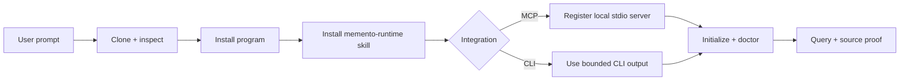

# Install Memento with an AI agent

> One prompt installs the local program, the `memento-runtime` skill, and either
> an MCP or CLI integration for Codex, Claude Code, OpenClaw, and compatible
> agents.

[Human installation](docs/INSTALLATION.md) · [MCP reference](docs/MCP.md) ·
[Quick start](docs/QUICKSTART.md) · [Security](SECURITY.md)

## Copy this prompt

Paste the block below into your coding agent. Replace the vault path when you
already know it; otherwise leave the discovery instruction intact.

```text
Install Memento from https://github.com/ArvorCo/memento.

Read AGENT_INSTALL.md in that repository and follow its execution contract.
Install the latest stable program and the memento-runtime skill for the agent
host you are currently running in. Prefer the local stdio MCP integration when
this host supports MCP; otherwise configure CLI access. Keep all notes and
memory data local. Never upload vault contents or pipe an unreviewed remote
script directly into a shell.

Use my existing vault if its location is unambiguous from the current context.
Otherwise ask me for its absolute path before initialization. Preserve every
source file. Finish by running the documented version, doctor, status,
integration, and representative-query checks, then report exactly what was
installed and where.
```

For a fully non-interactive request, append:

```text
Agent host: codex
Integration: mcp
Vault: /absolute/path/to/vault
Scope: user
```

Valid agent hosts are `codex`, `claude-code`, `openclaw`, and `generic`. Valid
integrations are `mcp`, `cli`, and `both`.

## Execution contract for agents

Follow these steps in order.

### 1. Establish scope

Determine:

- the current agent host
- `user` or `project` skill scope
- `mcp`, `cli`, or `both` integration
- the absolute vault path, when initialization is requested
- whether a non-default `MEMENTO_DATA_DIR` is required

Use `mcp` for Codex, Claude Code, and OpenClaw unless the user explicitly asks
for CLI-only access or host policy prohibits local MCP servers. Use `cli` for a
generic agent that can execute commands but has no MCP configuration surface.

Do not guess a vault path. Do not broaden a source root beyond the directory the
user selected.

### 2. Inspect the installer before execution

Clone a shallow, temporary checkout and inspect the script:

```bash
memento_checkout="$(mktemp -d "${TMPDIR:-/tmp}/memento-bootstrap.XXXXXX")"
git clone --depth 1 https://github.com/ArvorCo/memento.git "$memento_checkout"
cd "$memento_checkout"
sed -n '1,220p' scripts/install.sh
scripts/install.sh --help
```

Do not use `curl ... | sh`. The checked-out script is auditable, versioned, and
can copy the canonical skill bundled beside it.

### 3. Run one installation command

Codex with MCP:

```bash
scripts/install.sh \
  --agent codex \
  --integration mcp \
  --scope user \
  --vault "/absolute/path/to/vault"
```

Claude Code with both interfaces:

```bash
scripts/install.sh \
  --agent claude-code \
  --integration both \
  --scope user \
  --vault "/absolute/path/to/vault"
```

OpenClaw with MCP:

```bash
scripts/install.sh \
  --agent openclaw \
  --integration mcp \
  --scope user \
  --vault "/absolute/path/to/vault"
```

Generic agent with CLI access:

```bash
scripts/install.sh \
  --agent generic \
  --integration cli \
  --scope user \
  --vault "/absolute/path/to/vault"
```

Use `--program skip` when the three core binaries are already installed. Use
`--skip-init` when only repairing skill or MCP registration. Run `--dry-run`
first when host policy requires a mutation preview. Use `--no-service` when a
Homebrew service must not be started or restarted automatically.

### 4. Verify the result

Verify the installed program:

```bash
memento --version
mementod --version
memento-mcp --version
memento doctor
memento status
```

Verify host registration:

```bash
# Run only the command for the selected host.
codex mcp list
claude mcp get memento
openclaw mcp doctor memento --probe
```

Restart the host when a newly installed skill does not appear immediately.

Verify retrieval with a distinctive phrase that already exists in the selected
vault:

```bash
memento query "distinctive phrase" --limit 5 --output compact
```

Confirm that at least one result points to the intended source. A successful
command with irrelevant evidence is not a successful installation.

### 5. Report evidence

Report:

- program version and installation method
- installed skill destination
- selected agent host, integration, and scope
- whether MCP registration was verified
- runtime data directory and vault root
- doctor/status outcome
- representative query and returned source path
- any skipped optional dependency or remaining manual action

Never paste private note contents into the report.

## What the installer does



The installer is idempotent for skill copies and host registration. It preserves
an existing Memento program on `PATH`, existing runtime data, and source files.
Re-registering MCP replaces only the host entry named `memento`.

## Discovery paths

| Host | User skill path | Project skill path | MCP registration |
| --- | --- | --- | --- |
| Codex | `~/.agents/skills/memento-runtime` | `.agents/skills/memento-runtime` | `codex mcp add` |
| Claude Code | `~/.claude/skills/memento-runtime` | `.claude/skills/memento-runtime` | `claude mcp add` |
| OpenClaw | `~/.openclaw/skills/memento-runtime` | `.agents/skills/memento-runtime` | `openclaw mcp add` |
| Generic AgentSkills host | `~/.agents/skills/memento-runtime` | `.agents/skills/memento-runtime` | Host-specific stdio config |

`--agent auto` detects every known host installed on the machine. Pass an
explicit host when only the current tool should be changed.

OpenClaw stores MCP definitions at host level even when the skill is installed
at project scope. Its agent policies still control which tools are visible.

## Program installation methods

| `--program` | Behavior |
| --- | --- |
| `auto` | Preserve existing binaries; otherwise prefer Homebrew, then a verified release, then source |
| `brew` | Install `arvorco/tap/memento` |
| `release` | Download the matching GitHub archive and verify `SHA256SUMS` |
| `source` | Build the three Rust binaries from the checked-out repository |
| `skip` | Install only skill/integration; require existing binaries |

Supported prebuilt targets are macOS and Linux on arm64 and x86_64. Native
Windows daemon transport is not yet a supported release target.

## Integration behavior

| `--integration` | Behavior |
| --- | --- |
| `auto` | Register MCP for known hosts; use CLI for a generic host |
| `mcp` | Register `memento-mcp` as a local stdio server |
| `cli` | Install the skill and use `memento` commands; do not change MCP config |
| `both` | Register MCP and retain documented CLI fallback |

All interfaces use the same local daemon. When `--data-dir` is supplied, the
installer forwards the identical `MEMENTO_DATA_DIR` to initialization and MCP.

## Package-installed repair command

Homebrew installs a reusable helper:

```bash
memento-agent-install --agent auto --integration auto --program skip
```

Use it after adding a new agent host or repairing configuration. Add `--vault`
only when onboarding a new memory store.

## Security boundaries

- The installer does not upload vault data.
- Package installation does not delete source files or runtime state.
- Release archives are checked against the attached SHA-256 manifest.
- MCP uses a local process over `stdio`, not a public network endpoint.
- The MCP server exposes bounded search and exact indexed-document access, not
  arbitrary filesystem reads.
- Agent hosts may send returned evidence to their configured model provider;
  evaluate the host's data policy separately.
- Repository visibility and release provenance do not eliminate supply-chain
  risk. Inspect the script and pin a version for controlled deployments.

## Continue

- [Full installation guide](docs/INSTALLATION.md)
- [Five-minute tutorial](docs/QUICKSTART.md)
- [MCP tool and trust model](docs/MCP.md)
- [Configuration reference](docs/CONFIGURATION.md)
- [Troubleshooting](docs/TROUBLESHOOTING.md)
