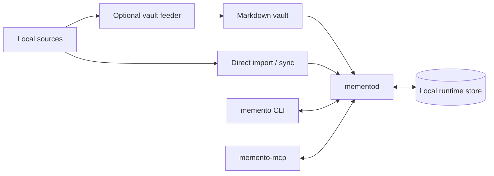

# Memento Architecture

Memento is a local-first language index runtime centered on three components:

- `libmemento` owns shared storage, parsing, chunking, learning, and retrieval
  primitives.
- `mementod` owns mutable local state, persistence, scheduling, and the local
  API.
- `memento` is the primary operator interface for init, diagnosis, ingest,
  sync, learning, status, and query.

Optional components remain downstream of that core: `memento-mcp` gives local
agents bounded access, `tools/vault_sync` normalizes heterogeneous sources into
a maintained Markdown vault, `memento-research` measures retrieval, and the web
surface explains the product.

The complete architecture—including component boundaries, ingestion flows,
runtime storage, atomic publication, query sequencing, scheduling, recovery,
transport security, and extension points—lives in
**[docs/ARCHITECTURE.md](docs/ARCHITECTURE.md)**.

Related documents:

- [Retrieval design](docs/RETRIEVAL.md)
- [Ingestion model](docs/INGESTION.md)
- [Configuration](docs/CONFIGURATION.md)
- [Security policy](SECURITY.md)
- [Product vision](VISION.md)
