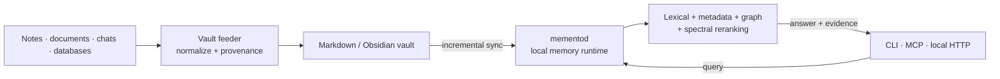

# Memento

[](https://github.com/ArvorCo/memento/actions/workflows/ci.yml)
[](https://github.com/ArvorCo/memento/releases)
[](LICENSE-MIT)
[](Cargo.toml)
[](docs/ARCHITECTURE.md)

> A fast, local-first memory engine that turns your notes, documents, and
> conversations into traceable evidence for humans and AI agents.

Memento makes an Obsidian vault—or any directory of useful material—queryable
without requiring a GPU, hosted embedding API, or proprietary LLM. It combines
an inverted index, BM25-style lexical scoring, metadata constraints, document
links, query-local PageRank, and optional spectral signals learned on-device.

It is not another vector database. Memento treats exact language, dates,
provenance, file structure, and links as first-class evidence.

> [!IMPORTANT]
> Memento is early-stage software. The local ingest → learn → query loop works,
> but storage and integration contracts may still evolve before 1.0.

## Why Memento?

Most agent memory systems either resend enormous context windows or outsource
retrieval to embeddings. Both approaches can be expensive, opaque, and weak at
exact names, identifiers, dates, or domain vocabulary.

Memento takes a different path:

| Principle | What it means in practice |
| --- | --- |
| **Local first** | Your source material and memory store remain on your machine by default. |
| **CPU first** | Core ingest, learning, and retrieval do not require a GPU or hosted model. |
| **Evidence first** | Results retain source paths, chunk positions, scores, and bounded excerpts. |
| **Structure aware** | Titles, paths, frontmatter, wikilinks, backlinks, and dates affect retrieval. |
| **Agent ready** | CLI JSON and a bounded local MCP server minimize context and tool exposure. |

## How it works



The core path has four steps:

1. **Ingest** files directly, or normalize heterogeneous sources into Markdown.
2. **Sync** content incrementally while preserving source provenance.
3. **Learn** local spectral signals and publish durable runtime state.
4. **Query** a bounded candidate set and return grounded evidence.

[Explore the architecture →](docs/ARCHITECTURE.md)

## What works today

| Area | Supported |
| --- | --- |
| Direct ingest | Files, folders, Obsidian vaults, Codex sessions, Claude sessions |
| Vault feeder | Markdown trees, PDFs, Office/e-book formats, CSV, TSV, JSON, notebooks |
| Conversations | Codex, Claude, Droid, ChatGPT exports, WhatsApp exports |
| Platform sources | Apple Notes and configured iCloud folders on macOS |
| Runtime platforms | Native macOS, Linux, and Windows on arm64 and x86_64 |
| Databases | Read-only SQLite, PostgreSQL, MySQL, and MariaDB queries |
| Retrieval | Indexed lexical search, metadata, temporal signals, wikilink graph, spectral reranking |
| Interfaces | Human CLI, compact JSON, local stdio MCP, optional authenticated HTTP |
| Operations | Guided setup, diagnostics, incremental sync, scheduler, ignore rules |

Not yet productized: Telegram ingestion, team/cloud sync as the primary mode,
and remotely hosted MCP.

## Quick start

### 1. Install

The fastest path is to give your coding agent one prompt. It installs Memento,
the portable `memento-runtime` skill, and either MCP or CLI access:

```text
Install Memento from https://github.com/ArvorCo/memento. Read AGENT_INSTALL.md
in that repository, install the program and memento-runtime skill for this
agent, prefer local MCP when supported, initialize my chosen vault, and verify
doctor, status, and one grounded query. Keep all memory data local.
```

[Copy the complete agent installation prompt →](AGENT_INSTALL.md)

For a manual installation on macOS:

```bash
brew install ArvorCo/tap/memento
```

On Windows, clone the repository, inspect the native installer, then run it
from PowerShell 5.1 or newer:

```powershell
git clone --depth 1 https://github.com/ArvorCo/memento.git
Set-Location memento
Get-Content .\scripts\install.ps1
powershell.exe -NoProfile -ExecutionPolicy Bypass -File .\scripts\install.ps1
```

Linux users can use the verified release installer or build from source. See
the platform-specific commands in the installation guide.

Prebuilt archives, source builds, and agent-host options are covered in the
[installation guide](docs/INSTALLATION.md).

### 2. Initialize your memory

Point Memento at an existing Obsidian vault or a new directory:

```bash
memento init --vault-root "$HOME/Documents/MyVault"
memento doctor
```

Initialization writes editable configuration under `~/.memento/config/` and
starts the local daemon when possible.

### 3. Sync, learn, and ask

```bash
memento sync obsidian "$HOME/Documents/MyVault"
memento learn
memento query "What did we decide about authentication?"
```

For an agent or script, request bounded JSON:

```bash
memento query "What changed in the release plan?" \
  --limit 5 \
  --output compact \
  --max-content-chars 500
```

That is the entire operating loop. The [five-minute tutorial](docs/QUICKSTART.md)
explains each result and shows how to verify it.

## Common workflows

```bash
# Inspect health and runtime state
memento doctor
memento status

# Import a single source
memento import file ./decision-log.md
memento import folder ./project-notes
memento import codex

# Keep a source synchronized without duplicate churn
memento sync folder ./project-notes
memento sync obsidian "$HOME/Documents/MyVault"

# Machine-readable automation
memento status --json
memento learn --json
```

For PDFs, Office documents, database rows, session exports, and multiple source
trees, use the feeder:

```bash
memento-vault-sync --config ~/.memento/config/vault_sync.toml capabilities
memento-vault-sync --config ~/.memento/config/vault_sync.toml --json run-all
```

> [!NOTE]
> `--config` and `--json` are feeder-wide options. Put them before the
> subcommand, as shown above.

## Give an agent local memory

`memento-mcp` exposes five bounded tools over local `stdio`: search, exact
document pagination, status, source sync, and learning. The repository also
ships a portable [`memento-runtime` skill](.agents/skills/memento-runtime/SKILL.md)
that teaches compatible agents how to install, operate, and validate Memento.

```bash
memento-agent-install --agent auto --integration auto --program skip
```

The agent searches first, then reads only an exact source returned by search.
It never receives arbitrary filesystem access from the MCP server.

[Install with one prompt →](AGENT_INSTALL.md) ·
[Configure MCP safely →](docs/MCP.md)

## Measured baseline

The current regression benchmark used optimized arm64 macOS binaries, a frozen
2,869-document personal-memory snapshot, and 30 curated English/Portuguese
questions. No hosted embedding or LLM call was used.

| Metric | Memento | Fielded BM25 baseline |
| --- | ---: | ---: |
| hit@5 | 100% | 73.3% |
| mean reciprocal rank | 1.000 | 0.650 |
| result-term recall | 0.980 | 0.947 |
| query latency p50 | 14.8 ms | 1.7 ms |
| query latency p95 | 17.6 ms | 2.0 ms |

Against v0.2.0 on the same corpus, dataset, and persisted store, hit@5 improved
from 86.7% to 100% and MRR from 0.793 to 1.000. Thirty cases are still a
regression suite, not a universal quality claim. Read the
[method, fingerprints, limitations, and reproduction guide](docs/BENCHMARKS.md).

## Documentation

| Start here | Build understanding | Operate and extend |
| --- | --- | --- |
| [Documentation home](docs/README.md) | [Architecture](docs/ARCHITECTURE.md) | [CLI reference](docs/CLI.md) |
| [Quick start](docs/QUICKSTART.md) | [Retrieval design](docs/RETRIEVAL.md) | [Configuration](docs/CONFIGURATION.md) |
| [Agent installation](AGENT_INSTALL.md) | [Ingestion model](docs/INGESTION.md) | [Troubleshooting](docs/TROUBLESHOOTING.md) |
| [Installation](docs/INSTALLATION.md) | [MCP integration](docs/MCP.md) | [Security model](SECURITY.md) |
| [Examples](docs/EXAMPLES.md) | [Benchmarks](docs/BENCHMARKS.md) | [Development](docs/DEVELOPMENT.md) |
| [Contributing](CONTRIBUTING.md) | [Project vision](VISION.md) | [Local HTTP API](docs/HTTP_API.md) |

The full map—including tutorials, how-to guides, reference material, and
project policies—is in [`docs/README.md`](docs/README.md).

## Project structure

```text
libmemento/        shared engine, format, chunking, learning, retrieval
mementod/          local daemon, runtime state, scheduler, local API
memento-cli/       operator CLI published as `memento`
memento-mcp/       bounded local stdio MCP server
tools/vault_sync/  configurable source-to-vault feeder
memento-research/  benchmarks and retrieval diagnostics
memento-web/       product website and future local memory UX
docs/              user, operator, architecture, and contributor guides
```

## Contributing

Memento welcomes focused contributions that improve the real ingest → learn →
query loop. Start with [CONTRIBUTING.md](CONTRIBUTING.md), run `make check`, and
include quality plus latency evidence for retrieval changes.

- [Roadmap](ROADMAP.md)
- [Code of Conduct](CODE_OF_CONDUCT.md)
- [Support](SUPPORT.md)
- [Security policy](SECURITY.md)
- [Changelog](CHANGELOG.md)

## License

Licensed under either the [MIT License](LICENSE-MIT) or the
[Apache License 2.0](LICENSE-APACHE), at your option.
