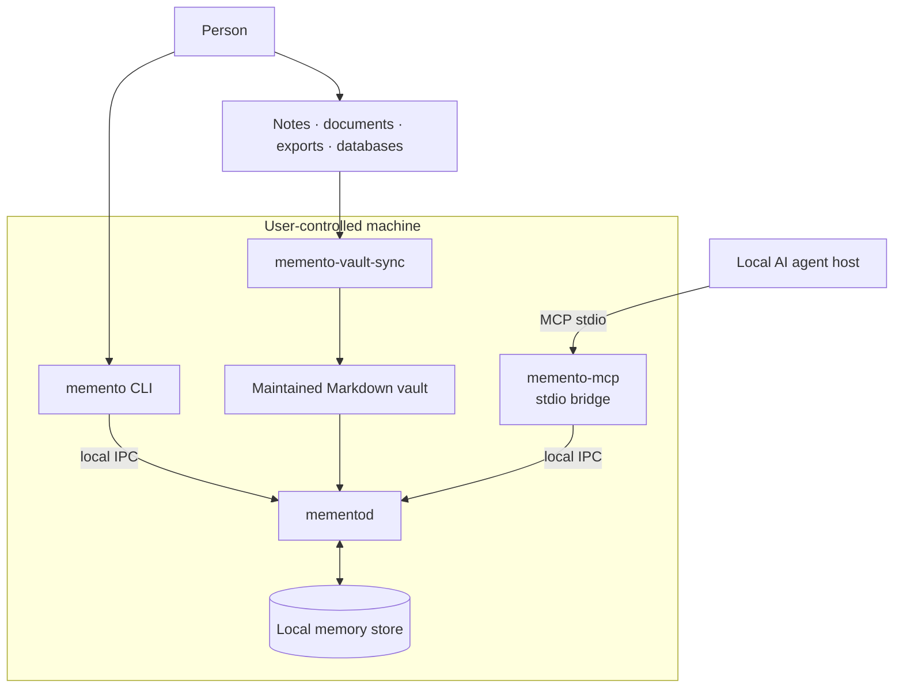
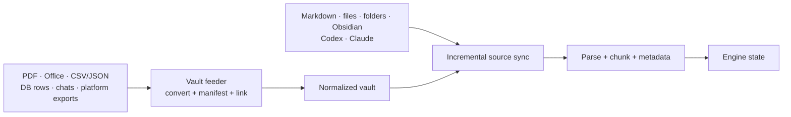
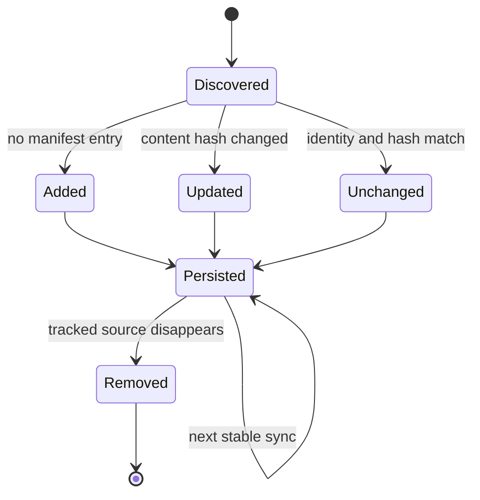
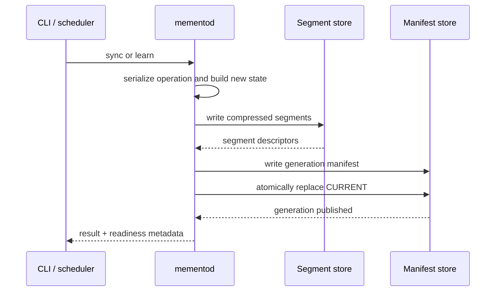
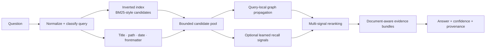
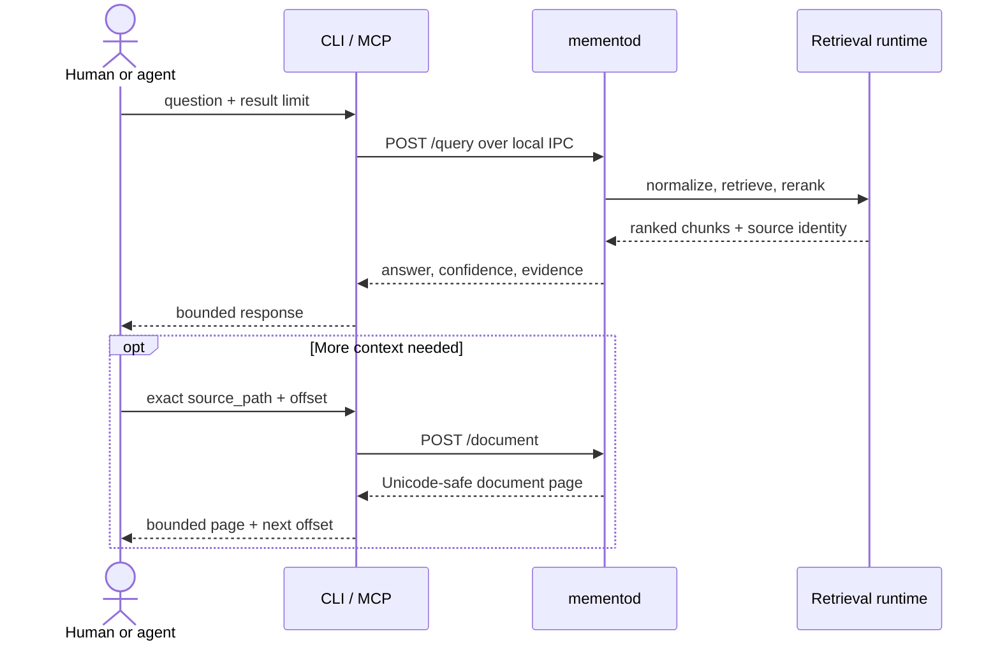
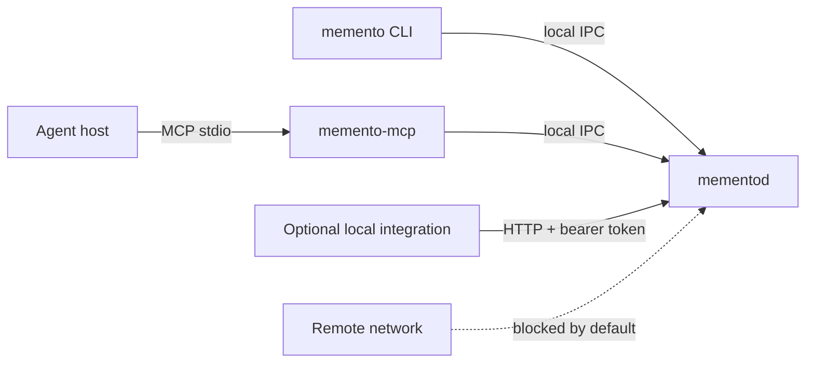
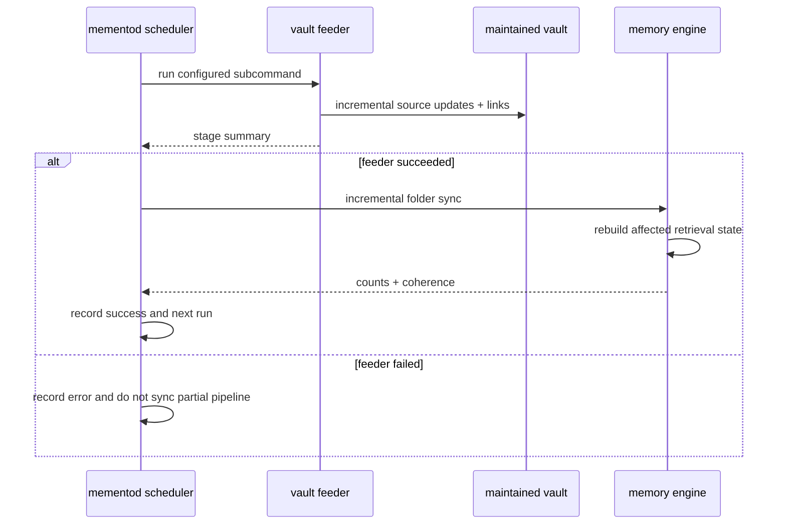

# System Architecture

> Memento is a local-first language index runtime: heterogeneous work becomes a
> durable local corpus, then bounded retrieval returns answers with provenance.

[← Documentation](README.md) · [Retrieval design](RETRIEVAL.md) ·
[Ingestion](INGESTION.md) · [Security](../SECURITY.md)

## Architectural goals

Memento optimizes for five properties:

1. **Local operation** — core workflows work without a hosted dependency.
2. **CPU efficiency** — exact and structured retrieval do not require a GPU.
3. **Traceability** — every result points back to a source and chunk.
4. **Durability** — runtime state survives restarts and publishes atomically.
5. **Bounded integration** — agents receive only the evidence they request.

These goals deliberately favor a daemon/CLI engine over a cloud-first API. The
web app and experimental remote surface are consumers of the core, not its
architectural center.

## System context



The default trust boundary is the user's machine. Network transport is absent
unless the operator explicitly adds the optional authenticated HTTP listener.

## Component map

| Component | Responsibility | Must not own |
| --- | --- | --- |
| `libmemento` | File format, chunking, parsers, matrix/learning primitives, runtime storage | Process lifecycle or product UI |
| `memento-ipc` | Cross-platform private endpoint naming and Windows pipe connection behavior | Retrieval or storage policy |
| `mementod` | Mutable engine state, persistence, retrieval pipeline, scheduler, local API | Cloud tenancy or arbitrary remote access |
| `memento-cli` | Human operations, onboarding, diagnostics, output formats, daemon readiness | A second retrieval implementation |
| `memento-mcp` | Bounded tool schemas and MCP/daemon translation | Direct vault reads or independent indexes |
| `tools/vault_sync` | Discovery, conversion, provenance, manifests, connectors, wiki hubs | Core ranking or memory storage |
| `memento-research` | Benchmarks, probes, backend diagnostics, regression evidence | Production serving |
| `memento-web` | Product explanation and future local UX | Core architectural authority |
| `memento-api` | Experimental future remote surface | Redefining local-first defaults |

Shared Rust logic belongs in `libmemento` when both the daemon and another
interface can use it. Mutable orchestration belongs in `mementod`. Source-specific
normalization that produces Markdown belongs in the feeder.

## Two ingestion paths



### Direct path

`memento import|sync` sends a source kind and optional path to the daemon. The
daemon enumerates supported input, applies `.mementoignore`, parses content,
chunks it, associates stable source records, rebuilds affected derived state,
and persists a new generation.

Direct sync is the shortest path for files the engine already understands.

### Feeder path

`memento-vault-sync` handles source discovery and normalization outside the
daemon. Each configured source has its own manifest. The feeder uses content
hashes and stable output paths to make repeated runs incremental, adds
frontmatter provenance, and optionally builds Obsidian-compatible hubs.

The daemon sees the resulting vault as ordinary documents. That separation
keeps conversion dependencies out of the Rust core and makes normalized output
inspectable before it becomes memory.

## Source identity and incremental sync



Ownership matters. A source manifest may remove output it previously created;
it must not delete an unrelated human file merely because a path resembles a
generated destination. The feeder linker follows the same rule by marking its
own hubs and refusing to replace an unmarked file.

## Runtime and process model

`mementod` is the single writer and query server for one data directory. It:

- loads the current published runtime generation
- falls back to the compatible `.memento` snapshot when needed
- recovers an interrupted ingest from a checkpoint snapshot
- owns the in-memory lexical index, document graph, and learned signals
- serializes state-changing operations
- publishes durable segments before advancing the current manifest pointer
- exposes the same routes over platform-local IPC and optional HTTP

The CLI probes readiness rather than relying on a blind sleep. The daemon writes
a PID during startup. Unix removes stale socket state before binding and cleans
the socket file on normal shutdown; Windows uses a named pipe whose first server
instance also enforces one daemon per store.

## Storage layout

One store is rooted at `MEMENTO_DATA_DIR` or `~/.memento`:

```text
~/.memento/
├── config/
│   ├── daemon.toml
│   ├── vault_sync.toml
│   ├── classification_rules.json
│   └── http_auth_token           optional; mode 0600 on Unix
├── manifests/
│   ├── CURRENT                   atomically published generation pointer
│   └── manifest-000…001.json     active segments and metadata
├── segments/
│   ├── segment-…-lexical.bin.zst
│   ├── segment-…-metadata.bin.zst
│   ├── segment-…-graph.bin.zst
│   └── segment-…-eigen.bin.zst   when learned state exists
├── runtime/
│   ├── active-operation.json     recoverable operation checkpoint
│   └── ingest-recovery.bin       temporary recovery state
├── sync/                         feeder and source manifests
├── wal/                          reserved runtime layout
├── caches/                       rebuildable data
├── snapshots/                    snapshot layout
├── default.memento               compatible v3 snapshot
├── memento.sock                  Unix local API while running
├── mementod.pid                  live process identity
└── mementod.log                  auto-start log
```

Not every path exists in a fresh store. `runtime/` recovery files are transient;
the current manifest and referenced segments define the published generation.

### Atomic publication



`default.memento` remains a compatibility snapshot while the segmented runtime
evolves. Format changes require roundtrip tests and explicit compatibility
analysis.

## Retrieval pipeline



Direct lexical and metadata candidates are protected from learned expansion.
The latter fills recall capacity; it does not get to erase exact evidence.
Document links are propagated only from strong query-local seeds, keeping graph
work bounded rather than running global PageRank per request.

The answer composer is extractive and evidence-bound. It has no requirement for
a hosted generative model. See [Retrieval design](RETRIEVAL.md) for scoring and
confidence semantics.

## Query sequence



Exact document pagination accepts only a `source_path` already present in the
memory store. This prevents the MCP bridge from becoming arbitrary filesystem
access.

## Transport and trust boundaries



Security properties:

- A Unix socket on macOS/Linux or local named pipe on Windows is the default.
- HTTP exists only when `--http-port` is passed.
- HTTP binds to loopback unless non-loopback exposure is explicitly allowed.
- Every HTTP route except `/health` requires a bearer or Memento token header.
- MCP responses are bounded and document reads are index-constrained.
- Database imports use read-only/query-only transactions and DSNs from the
  environment.

The current threat model protects against accidental network exposure and broad
agent reads. It is not a multi-tenant authorization system. See
[SECURITY.md](../SECURITY.md).

## Scheduler architecture

A configured `vault_sync` job is an orchestrated vertical slice:



The scheduler is intentionally narrow: 0.1.x supports `vault_sync`, not an
arbitrary shell scheduler.

## Failure and recovery model

- State-changing work is serialized with an operation lock.
- An active-operation checkpoint records progress for observability.
- A recovery snapshot can restore state after interrupted ingest.
- Segment manifests publish only after their referenced files are written.
- A failed feeder stage prevents the scheduled daemon sync from treating
  partial conversion output as a completed pass.
- Rebuildable indexes and graph state are derived from durable documents and
  chunks.

Operational recovery starts with `memento doctor`, `memento status --json`, and
the daemon log. Never delete a real data directory as a first diagnostic step;
reproduce with an isolated store instead.

## Extension points

| Need | Correct extension point |
| --- | --- |
| New directly parseable local source | `libmemento` parser/sync source plus daemon contract |
| New export or platform connector | `tools/vault_sync` producing provenance-rich Markdown |
| New retrieval signal | `mementod` bounded candidate/reranking pipeline with benchmark proof |
| New storage segment | `libmemento::storage` with manifest/version compatibility tests |
| New agent client | Consume MCP or compact CLI JSON; do not duplicate retrieval |
| New hosted surface | Remain optional and downstream of the local engine |

Every retrieval change should demonstrate quality and p50/p95 latency against a
representative corpus. Every storage change should prove roundtrip and restart
behavior. Every new external surface should update the threat model.

## Explicit non-goals

- Requiring a GPU or hosted embedding API for core retrieval
- Opening a network listener as an installation side effect
- Hiding weak retrieval behind fluent generated prose
- Making a cloud multi-tenant service the source of architectural truth
- Giving an agent unrestricted filesystem access through a memory tool

These constraints are what keep Memento useful as a trustworthy personal
memory substrate rather than another opaque context proxy.
