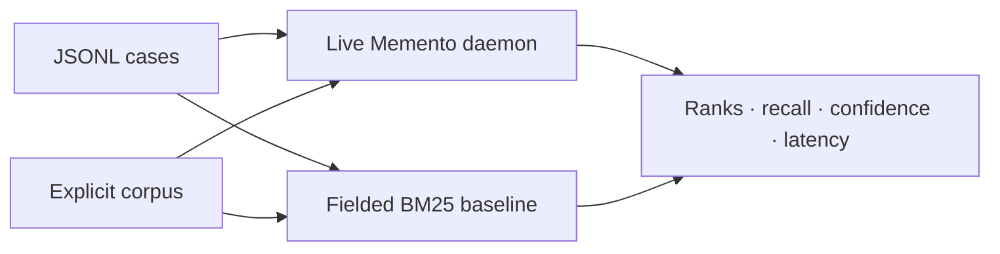

# Benchmarks

> Retrieval quality and latency are release criteria. A fluent answer cannot
> excuse a missed source.

[← Documentation](README.md) · [Retrieval design](RETRIEVAL.md) ·
[Development](DEVELOPMENT.md) · [Releasing](RELEASING.md)

## Current development baseline

Measured on 2026-08-19 with optimized arm64 macOS binaries against a frozen
snapshot of a private, real-world personal memory corpus:

- 2,869 supported non-empty source documents; 2,868 parsed by the baseline
- 24,563 indexed chunks
- 27,374,503 corpus bytes; SHA-256 `b671a5cf…63b81`
- 30 manually curated English and Portuguese questions
- one complete warm-up pass and five measured observations per question
- CPU-only lexical, metadata, graph, temporal, and spectral signals
- no hosted embedding or LLM call

The before and after runs used the same dataset SHA-256, corpus SHA-256, and
persisted Memento store. `v0.2.0` is commit `321942b`; v0.2.1 contains the
retrieval change described in this document.

| Metric | v0.2.0 | v0.2.1 | Fielded BM25 | v0.2.1 vs v0.2.0 |
| --- | ---: | ---: | ---: | ---: |
| hit@5 | 86.7% | 100% | 73.3% | +13.3 pp |
| mean reciprocal rank | 0.793 | 1.000 | 0.650 | +0.207 |
| result-term recall | 0.940 | 0.980 | 0.947 | +0.040 |
| answer-term recall | 0.747 | 0.760 | n/a | +0.013 |
| query latency p50 | 13.5 ms | 14.8 ms | 1.7 ms | +1.3 ms |
| query latency p95 | 16.2 ms | 17.6 ms | 2.0 ms | +1.4 ms |

Initial ingest took 4.51 seconds for 2,869 files and produced a 38 MiB store.
After restart and a warm query, the daemon used approximately 703 MiB RSS.
RSS is a steady-state observation, not a peak-memory measurement.

These numbers are a regression snapshot, not a universal search claim. Thirty
questions cover known failure classes and remain inadequate for estimating
performance across every vault, language, or query type. Raw cases and reports
stay private because the source corpus is personal.

## What the runner compares



Both paths use `libmemento` corpus discovery, including `.mementoignore`, built-in
directory exclusions, and supported document types. The runner refuses cases
whose expected source is outside that corpus.

The lexical comparator is an in-process, deterministic BM25F-style inverted
index over title, path, and body fields. It uses `k1 = 1.2`, `b = 0.75`, the
standard Robertson IDF formula, length normalization, and deterministic path
tie-breaking. It is intentionally smaller than Lucene or Tantivy, but no longer
a term-presence toy. See the [Tantivy BM25 implementation](https://github.com/quickwit-oss/tantivy/blob/main/src/query/bm25.rs),
[Lucene similarity reference](https://lucene.apache.org/core/9_3_0/core/org/apache/lucene/search/similarities/package-summary.html),
and Microsoft Research's [BM25F work](https://www.microsoft.com/en-us/research/publication/microsoft-cambridge-at-trec-2004-web-and-hard-track/).

A retrieval change should beat both its prior Memento result and this baseline
for the intended failure class.

## Dataset schema

The runner accepts one JSON object per line:

```json
{"id":"auth-001","query":"What did we decide about authentication?","expected_path":"decisions/auth.md","expected_title":"Authentication decision","expected_terms":["passkeys","offline"],"excerpt":"Use passkeys for the offline-first launch."}
```

| Field | Purpose |
| --- | --- |
| `id` | Stable case identity in reports and regressions |
| `query` | Exact user-like query sent to the daemon |
| `expected_path` | Source path relative to `--corpus`, or a canonical absolute path |
| `expected_title` | Human-readable expected document title |
| `expected_terms` | Facts/terms expected in results and answer |
| `excerpt` | Curator evidence used to justify the case |

The expected path must match the daemon's canonical source path. Term recall is
case- and accent-normalized; it should use distinctive facts, not only generic
query words.

## Metrics

### Hit rate at k

A case is a hit when `expected_path` appears anywhere in the first `k` results:

\[
\operatorname{Hit@k} = \frac{1}{|Q|}\sum_{q \in Q}
\mathbb{1}[\operatorname{rank}_q \le k]
\]

This measures recall of one designated source, not graded relevance of every
returned result.

### Mean reciprocal rank

\[
\operatorname{MRR} = \frac{1}{|Q|}\sum_{q \in Q}
\begin{cases}
1/\operatorname{rank}_q & \text{if found} \\
0 & \text{otherwise}
\end{cases}
\]

MRR rewards moving the expected source toward rank 1.

### Result-term recall

All returned evidence content for a case is concatenated. The metric is the
fraction of `expected_terms` found after text normalization. It measures fact
coverage in retrieval, not source correctness by itself.

### Answer-term recall

The same expected-term fraction is measured over Memento's answer. This catches
cases where the right evidence was retrieved but answer composition omitted a
required fact. The simple baseline has no answer layer.

### Confidence, stability, and latency

The runner records Memento's confidence and whether source rank remained stable
across measured repetitions. Confidence is diagnostic; it is not yet calibrated
as a probability of correctness.

Wall-clock duration is reported as total, average, p50, p95, and p99 using
nearest-rank-style percentile selection. Memento latency includes local IPC and
answer generation. BM25 index construction is reported separately from query
latency. On Unix, IPC uses a Unix socket; on Windows, it uses the same named-pipe
transport as the CLI.

With small suites, tail percentiles remain noisy even with repeated observations.

## Curate a dataset

High-value cases come from real failure modes:

| Failure class | Example case |
| --- | --- |
| Exact identity | Product/project/person with near-duplicate names |
| Complete date | Same event across multiple days or summaries |
| Episodic vs summary | Original daily note should beat a later digest |
| Canonical document | Profile/catalog query should find the maintained source |
| Link traversal | Evidence reachable through a deliberate wikilink |
| Multilingual term | Portuguese query with English source term |
| Conflicting evidence | Old and new decisions with explicit supersession |
| Long document | Expected fact outside the single sharpest passage |

Write the expected source and terms before tuning the ranker. Otherwise the
dataset merely ratifies the output you just produced.

## Generate candidate cases

The research tool can sample Markdown files and derive candidate queries:

```bash
cargo run --release -p memento-research -- benchmark build \
  --vault /absolute/path/to/vault \
  --output /tmp/memento-candidates.jsonl \
  --limit 250
```

Generated cases are seeds, not ground truth. Review each query, source, excerpt,
and expected term. Remove tautological queries that simply repeat a full title
and cases whose source is ambiguous.

## Run a benchmark

Use a release build and an isolated store prepared with the corpus under test:

```bash
export MEMENTO_DATA_DIR=/absolute/path/to/benchmark-store

cargo run --release -p memento-research -- benchmark run \
  --dataset /absolute/path/to/benchmark.jsonl \
  --corpus /absolute/path/to/frozen-corpus \
  --top-k 5 \
  --warmup 1 \
  --repetitions 5 \
  --report /tmp/memento-benchmark.json
```

`--corpus` is mandatory. The runner writes aggregate plus per-case JSON with
dataset and corpus SHA-256 fingerprints, parser counts, baseline build time,
confidence, rank stability, and repeated latency distributions. Use `--limit`
for a quick iteration without changing the dataset.

## Reproducible comparison protocol

For a before/after claim, hold these constant:

- hardware and power mode
- operating system and compiler toolchain
- release profile and feature flags
- exact source corpus and benchmark JSONL
- `MEMENTO_DATA_DIR` content and learned state
- `top-k`
- background workload

Recommended sequence:

1. freeze the source corpus; do not benchmark a live feeder destination
2. create/restore the same benchmark store with scheduler jobs disabled
3. start the release daemon and run the complete suite with warm-up/repetitions
4. retain the JSON report and its two SHA-256 fingerprints
5. apply the change and rebuild in release mode
6. restore the store if the change mutated format or learned state
7. rerun with the exact same dataset, corpus, and options
8. reject the comparison if either fingerprint differs
9. inspect aggregate deltas and every changed rank
10. repeat when latency differences are close to system noise

Do not compare a debug binary with a release binary or a cold start with a warm
run.

## Interpret regressions

| Symptom | Likely investigation |
| --- | --- |
| Hit rate falls | Candidate generation, protected exact recall, source identity |
| MRR falls but hits stay | Rerank weights, query mode, metadata/date bias |
| Result-term recall falls | Evidence bundle selection or chunking |
| Answer recall falls alone | Answer composition, cleaning, evidence cap |
| p50 rises | Hot-path postings, projection, allocation, serialization |
| p95/p99 rises | Large documents, graph expansion, cold caches, contention |
| BM25 baseline wins case | Query normalization or ranking complexity hurting exact search |

A single aggregate can hide offsetting failures. The per-case report is the
first place to look.

## Privacy and publishing

Personal vaults can expose names, plans, credentials, health information, and
private conversations through datasets, paths, misses, excerpts, or reports.

- keep raw personal datasets and reports outside Git
- do not paste absolute private paths into issues
- publish aggregate metrics only when the corpus cannot be shared
- use synthetic fixtures for regression tests in the repository
- review `misses` and `per_case` before attaching a report
- never upload a `.memento` store as debugging evidence

The current corpus is private, so the baseline is reproducible only in method,
not bit-for-bit data. That limitation must accompany the numbers.

## Current gaps

- larger manually judged suites
- nDCG or graded multi-source relevance
- adversarial stale/conflicting/near-duplicate cases
- repeatable cold-start, peak-memory, and ingest scaling curves
- 100,000+ document scaling curves
- multilingual suites beyond curated bridges
- calibrated confidence and factual entailment evaluation

These are roadmap items, not reasons to hide the current baseline.
