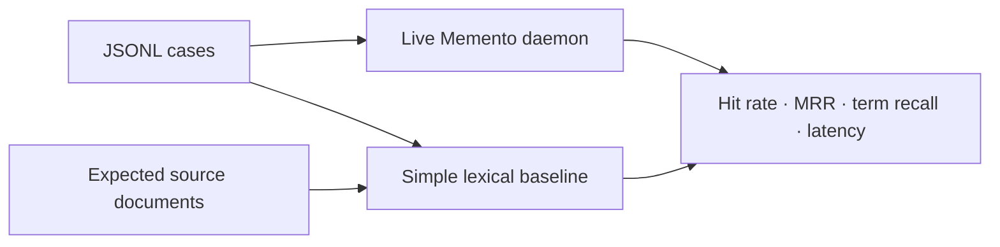

# Benchmarks

> Retrieval quality and latency are release criteria. A fluent answer cannot
> excuse a missed source.

[← Documentation](README.md) · [Retrieval design](RETRIEVAL.md) ·
[Development](DEVELOPMENT.md) · [Releasing](RELEASING.md)

## Current 0.1.0 baseline

Measured on 2026-08-17 with optimized arm64 macOS binaries against a private,
real-world Markdown corpus:

- 2,202 source documents
- 19,557 indexed chunks
- 69,327 vocabulary terms
- 1,580 resolved document-graph links
- 10 manually curated questions with expected source files and answer terms
- CPU-only postings, metadata, graph, temporal, and spectral signals
- no hosted embedding or LLM call

| Metric | Memento | Simple lexical baseline | Delta |
| --- | ---: | ---: | ---: |
| hit@10 | 100% | 90% | +10 pp |
| mean reciprocal rank | 1.000 | 0.900 | +0.100 |
| result-term recall | 1.000 | 0.960 | +0.040 |
| answer-term recall | 0.700 | n/a | n/a |
| query latency p50 | 13.5 ms | 14.9 ms | −1.4 ms |
| query latency p95 | 14.5 ms | 19.8 ms | −5.3 ms |

These numbers are a regression snapshot, not a universal search claim. Ten
questions are useful for catching known breakage and inadequate for estimating
performance across all vaults, languages, or query types.

## What the runner compares



The simple baseline loads the expected document set and applies deterministic
lexical scoring. It is a sanity floor, not Lucene, Tantivy, or a state-of-the-art
external engine. A retrieval change should beat both its prior Memento result
and this baseline for the intended failure class.

## Dataset schema

The runner accepts one JSON object per line:

```json
{"id":"auth-001","query":"What did we decide about authentication?","expected_path":"/absolute/vault/decisions/auth.md","expected_title":"Authentication decision","expected_terms":["passkeys","offline"],"excerpt":"Use passkeys for the offline-first launch."}
```

| Field | Purpose |
| --- | --- |
| `id` | Stable case identity in reports and regressions |
| `query` | Exact user-like query sent to the daemon |
| `expected_path` | Canonical absolute source path that should appear in top-k |
| `expected_title` | Human-readable expected document title |
| `expected_terms` | Facts/terms expected in results and answer |
| `excerpt` | Curator evidence used to justify the case |

The expected path must match the daemon's canonical source path. Term recall is
case- and accent-normalized; it should use distinctive facts, not only generic
query words.

## Metrics

### Hit rate at k

A case is a hit when `expected_path` appears anywhere in the first `k` results:

\[
\operatorname{Hit@k} = \frac{1}{|Q|}\sum_{q \in Q}
\mathbb{1}[\operatorname{rank}_q \le k]
\]

This measures recall of one designated source, not graded relevance of every
returned result.

### Mean reciprocal rank

\[
\operatorname{MRR} = \frac{1}{|Q|}\sum_{q \in Q}
\begin{cases}
1/\operatorname{rank}_q & \text{if found} \\
0 & \text{otherwise}
\end{cases}
\]

MRR rewards moving the expected source toward rank 1.

### Result-term recall

All returned evidence content for a case is concatenated. The metric is the
fraction of `expected_terms` found after text normalization. It measures fact
coverage in retrieval, not source correctness by itself.

### Answer-term recall

The same expected-term fraction is measured over Memento's answer. This catches
cases where the right evidence was retrieved but answer composition omitted a
required fact. The simple baseline has no answer layer.

### Latency

The runner records wall-clock duration per query and reports total, average,
p50, p95, and p99 using nearest-rank-style percentile selection. Memento latency
includes Unix-socket request/response and answer generation. The simple baseline
runs in the benchmark process after its documents are loaded.

With tiny suites, tail percentiles are unstable: p95 of ten cases is effectively
one slow observation.

## Curate a dataset

High-value cases come from real failure modes:

| Failure class | Example case |
| --- | --- |
| Exact identity | Product/project/person with near-duplicate names |
| Complete date | Same event across multiple days or summaries |
| Episodic vs summary | Original daily note should beat a later digest |
| Canonical document | Profile/catalog query should find the maintained source |
| Link traversal | Evidence reachable through a deliberate wikilink |
| Multilingual term | Portuguese query with English source term |
| Conflicting evidence | Old and new decisions with explicit supersession |
| Long document | Expected fact outside the single sharpest passage |

Write the expected source and terms before tuning the ranker. Otherwise the
dataset merely ratifies the output you just produced.

## Generate candidate cases

The research tool can sample Markdown files and derive candidate queries:

```bash
cargo run --release -p memento-research -- benchmark build \
  --vault /absolute/path/to/vault \
  --output /tmp/memento-candidates.jsonl \
  --limit 250
```

Generated cases are seeds, not ground truth. Review each query, source, excerpt,
and expected term. Remove tautological queries that simply repeat a full title
and cases whose source is ambiguous.

## Run a benchmark

Use a release build and an isolated store prepared with the corpus under test:

```bash
export MEMENTO_DATA_DIR=/absolute/path/to/benchmark-store

cargo run --release -p memento-research -- benchmark run \
  --dataset /absolute/path/to/benchmark.jsonl \
  --top-k 10 \
  --report /tmp/memento-benchmark.json
```

The runner checks that the daemon is available and writes aggregate plus
per-case JSON. Use `--limit` for a quick iteration without changing the dataset.

## Reproducible comparison protocol

For a before/after claim, hold these constant:

- hardware and power mode
- operating system and compiler toolchain
- release profile and feature flags
- exact source corpus and benchmark JSONL
- `MEMENTO_DATA_DIR` content and learned state
- `top-k`
- background workload

Recommended sequence:

1. create/restore the same benchmark store
2. start the release daemon and perform one warm-up query
3. run the complete suite and retain its JSON report
4. apply the change and rebuild in release mode
5. restore the store if the change mutated format or learned state
6. run the same warm-up and suite
7. inspect aggregate deltas and every changed rank
8. repeat when latency differences are close to system noise

Do not compare a debug binary with a release binary or a cold start with a warm
run.

## Interpret regressions

| Symptom | Likely investigation |
| --- | --- |
| Hit rate falls | Candidate generation, protected exact recall, source identity |
| MRR falls but hits stay | Rerank weights, query mode, metadata/date bias |
| Result-term recall falls | Evidence bundle selection or chunking |
| Answer recall falls alone | Answer composition, cleaning, evidence cap |
| p50 rises | Hot-path postings, projection, allocation, serialization |
| p95/p99 rises | Large documents, graph expansion, cold caches, contention |
| Simple baseline wins case | Query normalization or ranking complexity hurting exact search |

A single aggregate can hide offsetting failures. The per-case report is the
first place to look.

## Privacy and publishing

Personal vaults can expose names, plans, credentials, health information, and
private conversations through datasets, paths, misses, excerpts, or reports.

- keep raw personal datasets and reports outside Git
- do not paste absolute private paths into issues
- publish aggregate metrics only when the corpus cannot be shared
- use synthetic fixtures for regression tests in the repository
- review `misses` and `per_case` before attaching a report
- never upload a `.memento` store as debugging evidence

The 0.1.0 corpus is private, so the baseline is reproducible only in method, not
bit-for-bit data. That limitation must accompany the numbers.

## Current gaps

- larger manually judged suites
- nDCG or graded multi-source relevance
- adversarial stale/conflicting/near-duplicate cases
- cold-start and ingest throughput
- peak memory and index size
- 100,000+ document scaling curves
- multilingual suites beyond curated bridges
- comparison with mature lexical engines under the same corpus contract
- calibrated confidence and factual entailment evaluation

These are roadmap items, not reasons to hide the current baseline.
