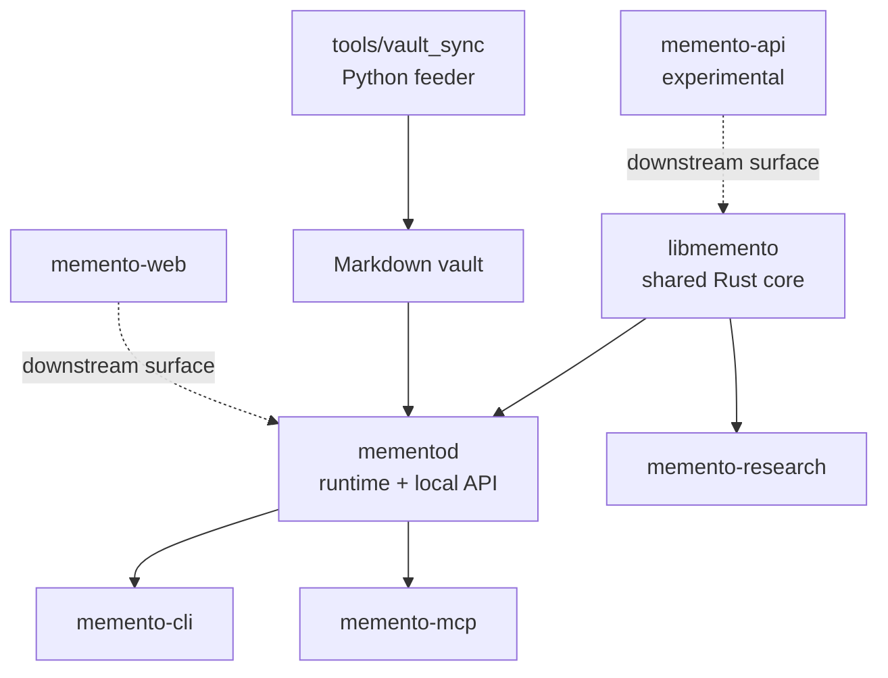

# Development Guide

> Build, test, benchmark, and extend Memento without compromising local-first
> behavior, user data, or format compatibility.

[← Documentation](README.md) · [Contributing](../CONTRIBUTING.md) ·
[Architecture](ARCHITECTURE.md) · [Benchmarks](BENCHMARKS.md)

## Prerequisites

| Tool | Baseline | Used for |
| --- | --- | --- |
| Rust | 1.88+ | Engine, daemon, CLI, MCP, research |
| Python | 3.12 | Vault feeder and sync tools |
| `uv` | current stable | Python environment and commands |
| Node.js | 22 | Web app |
| Pandoc | optional | Document conversion tests/workflows |
| Poppler | optional | PDF layout extraction |
| Tesseract | optional | Image-only PDF OCR |

Clone and install development dependencies:

```bash
git clone https://github.com/ArvorCo/memento.git
cd memento
uv sync --group dev
cd memento-web && npm ci && cd ..
```

## Workspace map



| Path | Change it when… |
| --- | --- |
| `libmemento/` | Behavior is a reusable engine, format, parser, matrix, or storage primitive |
| `mementod/` | Behavior needs mutable runtime state, persistence, ranking orchestration, API, or scheduling |
| `memento-cli/` | A human-facing command, setup flow, output format, or diagnostic changes |
| `memento-mcp/` | Tool schema, bounds, safety annotations, or MCP translation changes |
| `memento-research/` | Evaluation datasets, metrics, probes, or benchmark reporting changes |
| `tools/vault_sync/` | A source export must become provenance-rich Markdown |
| `memento-web/` | Product explanation or future local UX changes |
| `docs/` | User workflow, interface, architecture, or operations change |

Do not put reusable engine logic in the CLI. Do not put conversion dependencies
in the daemon when inspectable Markdown is the cleaner boundary. Do not make the
experimental API define the core.

## Fast validation

Run the checks relevant to your change while iterating:

```bash
# Rust
cargo fmt --all -- --check
cargo clippy --workspace --all-targets -- -D warnings
cargo test --workspace

# Python
uv run ruff check tools
uv run ruff format --check tools
uv run python -m unittest discover -s tools/vault_sync/tests -v

# Documentation
make docs-check

# Web
cd memento-web
npm run lint
npm run build
```

Repository shortcuts:

```bash
make uv-sync
make py-lint
make py-test
make rust-check
make check
make release-check
make fmt
```

`make check` is the default pull-request gate. Web checks remain separate so
backend contributors do not pay the Node installation cost unless needed.

## Run a local development stack

Use an isolated store, not your daily memory:

```bash
runtime_dir="$(mktemp -d /tmp/memento-dev.XXXXXX)"
vault_dir="$(mktemp -d /tmp/memento-vault.XXXXXX)"

export MEMENTO_DATA_DIR="$runtime_dir"
cargo run -p memento-cli -- init --vault-root "$vault_dir" --force
cargo run -p mementod -- --foreground
```

In a second terminal, export the same data directory:

```bash
export MEMENTO_DATA_DIR=/path/printed/by/the/first/terminal
cargo run -p memento-cli -- status
cargo run -p memento-cli -- sync obsidian /absolute/path/to/test-vault
cargo run -p memento-cli -- query "unique fixture phrase" --output compact
```

For logs:

```bash
RUST_LOG=mementod=debug cargo run -p mementod -- --foreground
```

Avoid testing write or deletion semantics against a personal vault. A minimal
fixture is easier to reason about and safe to attach to a bug report.

## Change-specific expectations

### Storage or `.memento` format

- preserve versioned roundtrip behavior
- test fresh creation and restart loading
- test manifest/segment publication and fallback paths
- test interrupted-operation recovery
- document compatibility or migration effects
- never silently reinterpret user data under an existing format version

### Ingestion or sync

- test first import, unchanged second run, update, and deletion
- test path normalization and traversal rejection
- preserve source identity and provenance
- prove an importer cannot delete an unowned file
- test empty, malformed, Unicode, and large input where relevant

### Retrieval or learning

- add a focused failure fixture before changing weights
- compare Memento with the simple lexical baseline
- report hit rate, MRR, term recall, and p50/p95 latency
- test exact names, full dates, near-duplicate notes, and conflicting evidence
- keep direct lexical/metadata candidates protected from learned expansion
- explain any complexity or memory-footprint change

### Daemon or scheduler

- test readiness and cleanup, not blind sleeps
- test restart and live status surfaces
- keep network listeners opt-in
- preserve one-writer semantics for a data directory
- ensure child-process failure is visible and does not publish false success

### MCP or HTTP

- bound every request and response field
- maintain truthful read-only/destructive/idempotent annotations
- never turn document access into arbitrary path access
- keep protocol stdout clean
- update the threat model and integration docs

### Documentation

- update the closest task guide and exact reference page
- keep the root README focused on discovery and first success
- use relative links within the repository
- add `accTitle` and `accDescr` to every Mermaid diagram
- use placeholders, never personal absolute paths
- run `make docs-check`

## Test organization

| Layer | Primary location |
| --- | --- |
| Core unit tests | colocated Rust `#[cfg(test)]` modules |
| Core integration/format tests | `libmemento/tests/` |
| CLI integration tests | `memento-cli/tests/` |
| Daemon runtime/retrieval tests | `mementod/src/manager/tests*.rs` |
| MCP tool/schema tests | `memento-mcp/src/` test modules |
| Feeder tests | `tools/vault_sync/tests/` |
| Agent installer tests | `scripts/test-install.sh` |
| Web checks | `memento-web` lint/build |

Prefer the smallest test that proves the behavior. Add an end-to-end test when
the risk is in interaction between components rather than an isolated function.

## Benchmark workflow

Retrieval work is incomplete without measurement:

```bash
cargo run --release -p memento-research -- doctor
cargo run --release -p memento-research -- benchmark run \
  --dataset /absolute/path/to/benchmark.jsonl \
  --top-k 10 \
  --report /tmp/memento-benchmark.json
```

Keep private corpora and reports outside Git. Commit synthetic or explicitly
redistributable fixtures only. Compare the same binary profile, hardware class,
dataset, and store state before and after.

Read [BENCHMARKS.md](BENCHMARKS.md) for schema and metric semantics.

## Python feeder development

Always run through `uv`:

```bash
uv sync --group dev
uv run python -m tools.vault_sync.cli --help
uv run ruff check tools
uv run ruff format tools
uv run python -m unittest discover -s tools/vault_sync/tests -v
```

Connector rules:

- all paths and behavior come from config
- never hardcode a developer's home directory
- manifests are atomically written
- destination paths stay inside the vault
- credentials stay in named environment variables
- conversion output identifies provenance and converter
- unavailable optional tools produce actionable errors or capabilities

## Rust development

Targeted loops:

```bash
cargo test -p libmemento
cargo test -p mementod
cargo test -p memento-mcp
cargo test -p memento-research
cargo clippy -p mementod --all-targets -- -D warnings
```

Use `cargo fmt --all`; the workspace shares one formatting surface. Keep a file
below roughly 1,000 lines by extracting cohesive modules before it becomes a
review bottleneck.

## Web development

```bash
cd memento-web
npm ci
npm run dev
npm run lint
npm run build
```

The web app should explain the actual product and local-first architecture. It
must not invent cloud features or compensate for engine gaps with generic
template copy.

## Documentation workflow

The documentation follows four reader needs:

- tutorials create a successful learning journey
- how-to guides solve a concrete task
- reference pages state exact contracts
- explanation pages build architectural understanding

When a command changes, update its `--help`, [CLI.md](CLI.md), and any tutorial
that copies it. When config changes, update the example TOML, parser tests,
[CONFIGURATION.md](CONFIGURATION.md), and `doctor` validation when appropriate.

## Pull request handoff

Before opening a PR:

```bash
make check
git diff --check
```

Also run web checks when the web app changed and an optimized benchmark when
retrieval changed. The PR description should state:

- user-visible outcome
- smallest architectural slice affected
- verification commands and results
- retrieval metrics when relevant
- format, security, privacy, or compatibility impact

Follow [CONTRIBUTING.md](../CONTRIBUTING.md) and the pull request template.
