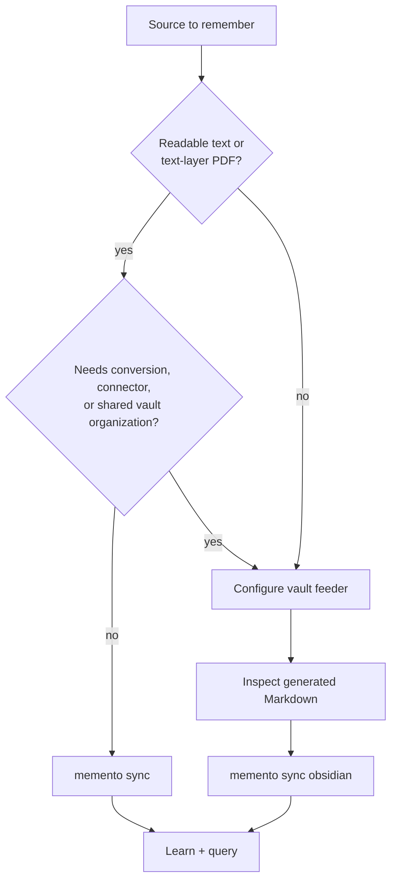
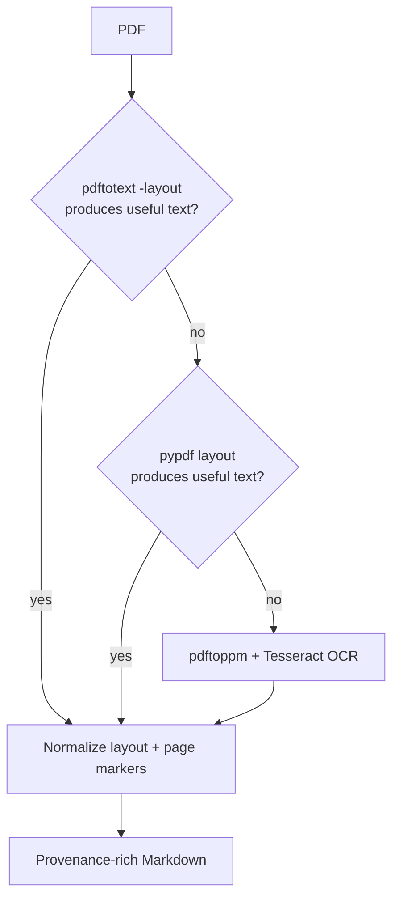

# Ingestion and Vault Maintenance

> Bring local work into Memento directly, or normalize heterogeneous sources
> into one inspectable Markdown vault first.

[← Documentation](README.md) · [Configuration](CONFIGURATION.md) ·
[Examples](EXAMPLES.md) · [Architecture](ARCHITECTURE.md#two-ingestion-paths)

## Choose the right path

Memento has two complementary ingestion layers:

| Need | Use | Why |
| --- | --- | --- |
| One readable file, folder, or Obsidian vault | `memento sync` | Shortest path into the daemon |
| Local Codex or Claude sessions | `memento sync codex` / `memento sync claude` | Native parser and replace-on-sync behavior |
| PDF with a usable text layer | Direct sync or feeder | Direct is fast; feeder adds richer cleanup/provenance |
| Image-only PDF or Office document | `memento-vault-sync import-documents` | Local converters and OCR fallback |
| Chat exports, Apple Notes, iCloud, or database rows | Vault feeder | Source-specific normalization and manifests |
| Several sources feeding one Obsidian brain | Vault feeder + `memento sync obsidian` | Inspectable output and shared link graph |



## Direct daemon ingestion

### Sources

| Source | Path | Repeat-safe command |
| --- | --- | --- |
| File | required | `memento sync file ./note.md` |
| Folder | required | `memento sync folder ./notes` |
| Obsidian vault | required | `memento sync obsidian "$HOME/Documents/MyVault"` |
| Codex sessions | inferred | `memento sync codex` |
| Claude sessions | inferred | `memento sync claude` |

`memento import folder` and `memento import obsidian` delegate to incremental
sync. For files and session stores, repeated `import` can append another source
load; use `sync` when the source will be revisited.

Folder and Obsidian discovery accepts text-like files including Markdown, plain
text, PDF, JSON/JSONL, common source code, YAML/TOML, CSV, SQL, HTML/CSS/XML,
MDX, and configuration files. Binary Office formats deliberately fail with an
actionable feeder recommendation.

Direct PDF parsing requires a useful embedded text layer. Scanned PDFs should
use the feeder's OCR pipeline.

### Incremental behavior

Direct file/folder/Obsidian sync fingerprints path, size, and modification time.
It then:

1. preserves unchanged files
2. removes chunks owned by modified or deleted files
3. parses changed files in bounded batches
4. checkpoints recoverable progress
5. rebuilds affected indexes and the document graph
6. performs a bounded learning pass
7. publishes a new durable runtime generation

The result reports added, updated, removed, and unchanged files. Run the same
command twice to confirm the second pass is stable.

### Ignore rules

Place `.mementoignore` at the synchronized root:

```gitignore
.git/
.obsidian/
node_modules/
target/
dist/
*.log
.env
.env.*
*.pem
/private/
/exports/
```

The engine also skips common dependency, build, and vault-internal directories.
Your ignore file is where privacy- and project-specific exclusions belong.

> [!IMPORTANT]
> Direct discovery supports source code and configuration files—including names
> beginning with `.env`—because some users intentionally index technical
> context. Secrets are not safe memory material. Exclude environment files,
> keys, credentials, and private subtrees explicitly.

A second safety rule applies to tracked deletion:

> [!WARNING]
> Sync treats disappearance from a tracked source as deletion of that source's
> stale chunks. Verify the exact root and ignore rules before the first large
> sync.

## Vault feeder

The feeder discovers sources, converts them into Markdown, records provenance,
and maintains its own manifests. It does not write directly into the `.memento`
runtime store.

Installed form:

```bash
memento-vault-sync --config ~/.memento/config/vault_sync.toml capabilities
memento-vault-sync --config ~/.memento/config/vault_sync.toml --json run-all
```

Source checkout:

```bash
uv run python -m tools.vault_sync.cli \
  --config ~/.memento/config/vault_sync.toml \
  --json run-all
```

Global flags precede the subcommand.

### Pipeline order

`run-all` executes:


A failure produces a non-zero stage status. Scheduled execution does not proceed
to daemon sync when the feeder command fails.

## Source and format matrix

| Source | Method | Incremental identity | Notes |
| --- | --- | --- | --- |
| Markdown tree | copy | source-relative path + content state | Protected globs preserve human hubs |
| Generic documents | convert | source-relative path + SHA-256 | Stable `.md` output and optional raw copy |
| SQLite rows | query | configured unique ID + row hash | File opened `mode=ro`, `query_only` |
| PostgreSQL rows | query | configured unique ID + row hash | `BEGIN READ ONLY`; DSN from env |
| MySQL/MariaDB rows | query | configured unique ID + row hash | read-only transaction; DSN from env |
| Codex | parse export | session file + manifest | JSONL → Markdown |
| Claude | parse export | session file + manifest | Can exclude subagent paths |
| Droid | parse export | session file + manifest | JSONL → Markdown |
| ChatGPT | parse export | conversation export + manifest | `conversations*.json` |
| WhatsApp | parse export | export + manifest | ZIP/text only; no account connection |
| Apple Notes | local automation | note export | macOS permission may be required |
| iCloud folders | copy/convert | configured relative path | macOS filesystem source |

## Document conversion

Configure one or more sources:

```toml
[[document_import.sources]]
name = "research"
enabled = true
source = "~/Documents/Research"
destination = "documents/research"
manifest = "documents-research.json"
include_extensions = [".pdf", ".docx", ".pptx", ".xlsx", ".csv", ".json"]
exclude_dirs = [".git", ".obsidian", "node_modules", ".venv"]
preserve_raw = false
delete_removed = true
tags = ["research", "imported"]
max_file_bytes = 104857600
```

Run one source:

```bash
memento-vault-sync --config ~/.memento/config/vault_sync.toml \
  import-documents research
```

### Conversion routes

| Input | Preferred local route |
| --- | --- |
| Markdown, MDX, text, logs, YAML, TOML, SQL | UTF-8 text normalization |
| CSV, TSV | Markdown table-oriented conversion |
| JSON | Readable structured Markdown/code representation |
| PDF | `pdftotext -layout` → pypdf layout → local OCR |
| DOCX, ODT, RTF, PPTX, XLSX, HTML, EPUB, notebook, Org, RST, TeX | Pandoc |
| Legacy DOC | LibreOffice or macOS `textutil`, then Pandoc |

Use `capabilities` to see what is available on the current machine. Pandoc and
Poppler are recommended package dependencies; Tesseract is optional for
image-only OCR; LibreOffice is optional for legacy documents.

### PDF quality pipeline



Cleanup removes repeated page-edge headers/footers and repairs conservative
line-break hyphenation. Multi-page output retains page markers. Complex tables,
handwriting, mathematical layout, and poor scans still need human review.

OCR remains local but is slower and depends on installed language data.

### Provenance contract

Generated documents carry frontmatter including fields such as:

```yaml
---
title: "Example Paper"
memento_source: "file:///absolute/source/path/paper.pdf"
memento_source_type: "pdf"
memento_source_sha256: "…"
memento_converter: "pdftotext"
tags: ["research", "imported"]
---
```

Exact fields vary by converter. The invariant is that output identifies its
origin, source type, transformation, and stable content state.

## Read-only database ingestion

Database rows become one Markdown document per stable ID:

```toml
[[database_import.sources]]
name = "decisions"
enabled = true
driver = "sqlite"
database = "~/data/knowledge.db"
query = "SELECT id, title, body, updated_at FROM decisions ORDER BY id"
destination = "databases/decisions"
manifest = "database-decisions.json"
id_column = "id"
title_column = "title"
content_columns = ["body"]
metadata_columns = ["updated_at"]
updated_at_column = "updated_at"
tags = ["database", "decisions"]
delete_removed = true
```

The query must begin with `SELECT` or `WITH`. The importer fetches remote rows in
batches of 500, rejects missing or duplicate IDs, hashes the complete row, and
rolls back the transaction before closing.

For PostgreSQL:

```toml
driver = "postgres"
dsn_env = "BRAIN_POSTGRES_DSN"
```

For MySQL or MariaDB:

```toml
driver = "mysql"
dsn_env = "BRAIN_MYSQL_DSN"
```

Never store a DSN in TOML. Install `psycopg` for PostgreSQL or `pymysql` for
MySQL/MariaDB in the feeder's Python environment.

> [!CAUTION]
> Parser-level `SELECT` validation and a read-only transaction are defense in
> depth, not a substitute for a database account with read-only grants.

## AI sessions and chat exports

```bash
memento-vault-sync --config ~/.memento/config/vault_sync.toml \
  import-sessions codex
memento-vault-sync --config ~/.memento/config/vault_sync.toml \
  import-sessions all
```

Connectors read local export directories. They do not sign into accounts or
send session content over the network. Destination notes preserve connector
labels, source tags, and session identity in frontmatter.

Chat/session data is often noisy. Consider separate destinations and add only
the sources whose future retrieval value exceeds their privacy and index cost.

## Wiki linker

The final feeder stage creates:

- one root hub
- a hub for every populated directory hierarchy
- topic hubs for tags meeting the configured occurrence threshold
- parent, child, and topic relationships
- bounded navigation blocks in ordinary notes

Generated hubs contain `memento_generated: true`. Navigation uses explicit
`<!-- memento:nav:start -->` and `<!-- memento:nav:end -->` markers. Repeated runs
are idempotent, and a human-owned file at a target hub path is never overwritten.

These links are useful twice: humans can browse them in Obsidian, and the daemon
turns them into a query-local document graph.

## Deletion and ownership guarantees

| Layer | What it may remove |
| --- | --- |
| Direct sync | Indexed chunks/documents owned by missing files in that source manifest |
| Markdown feeder | Destination files it previously recorded, excluding protected globs |
| Document feeder | Converted/raw outputs recorded in that source manifest |
| Database feeder | Row outputs recorded for IDs absent from the next query result |
| Wiki linker | Never removes or overwrites an unmarked human-owned hub |

Set `delete_removed = false` on a feeder source when historical output must
remain after the upstream item disappears. That changes retention semantics; it
does not change indexing until the maintained vault is synced again.

## Safe validation procedure

Use temporary, explicit paths before connecting a production brain:

```bash
runtime_dir="$(mktemp -d /tmp/memento-runtime.XXXXXX)"
vault_dir="$(mktemp -d /tmp/memento-vault.XXXXXX)"

export MEMENTO_DATA_DIR="$runtime_dir"
memento init --vault-root "$vault_dir" --force
memento-vault-sync --config /absolute/path/to/test-vault-sync.toml --json run-all
memento sync obsidian "$vault_dir" --json
memento learn --json
memento query "a unique fact from the fixture" --output compact
```

Then:

1. run the feeder twice and compare stage counts
2. run direct sync twice and confirm unchanged counts
3. edit one fixture and verify exactly one owned output changes
4. delete one fixture and verify only its owned output/chunks disappear
5. inspect generated frontmatter and hubs
6. query an exact term, a date, and a wikilink-connected fact

Do not use a personal vault as the first test of new deletion rules or connector
configuration.
