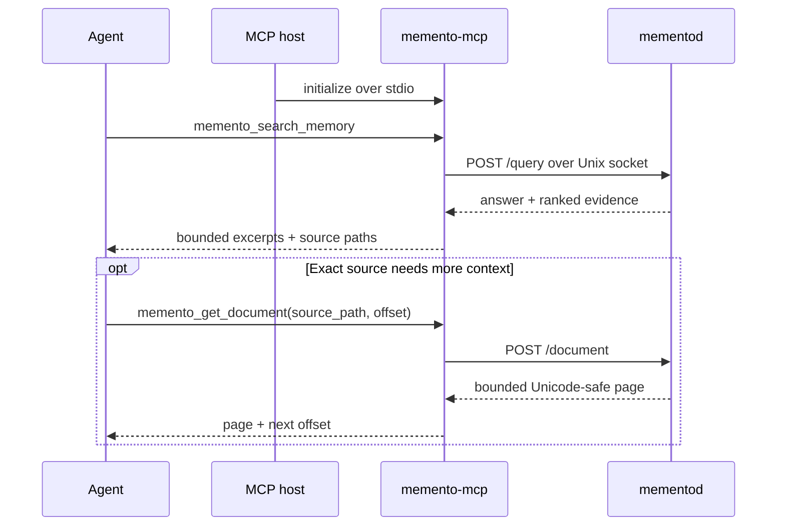

# MCP Integration

> Give a local AI agent fast, bounded access to already-ingested memory without
> granting arbitrary filesystem access.

[← Documentation](README.md) · [Quick start](QUICKSTART.md) ·
[Architecture](ARCHITECTURE.md#transport-and-trust-boundaries) ·
[Troubleshooting](TROUBLESHOOTING.md#mcp-client-cannot-start-or-call-tools)

## Model

`memento-mcp` is a local MCP server. Its host communicates over `stdio`; the
server communicates with `mementod` over the local Unix socket.



No hosted call is made by this bridge. The host may still be a cloud-backed AI
application; evaluate that application's own data handling separately.

## Prerequisites

```bash
memento-mcp --version
memento status
```

Both commands must refer to the same data directory. If the daemon is not
running, start it:

```bash
mementod --foreground
```

## Register automatically

The packaged installer can install the
[`memento-runtime` skill](../.agents/skills/memento-runtime/SKILL.md) and register
the local stdio server for each supported host:

```bash
memento-agent-install --agent auto --integration mcp --program skip
```

Pass an explicit `--agent codex`, `--agent claude-code`, or `--agent openclaw`
when only one host should change. Add `--data-dir /absolute/path/to/store` to
keep the MCP process aligned with a non-default daemon store. The complete
copy-paste workflow is in [AGENT_INSTALL.md](../AGENT_INSTALL.md).

## Register with Codex

```bash
codex mcp add memento -- memento-mcp
codex mcp list
```

For an isolated or non-default store:

```bash
codex mcp add memento \
  --env MEMENTO_DATA_DIR=/absolute/path/to/store \
  -- memento-mcp
```

Equivalent `~/.codex/config.toml`:

```toml
[mcp_servers.memento]
command = "memento-mcp"
startup_timeout_sec = 10
tool_timeout_sec = 60
default_tools_approval_mode = "writes"

[mcp_servers.memento.env]
MEMENTO_DATA_DIR = "/absolute/path/to/store"
```

Use the current [official Codex MCP
documentation](https://developers.openai.com/codex/mcp/) for host-specific
configuration and approval controls.

## Register with Claude Code

```bash
claude mcp add --transport stdio --scope user memento -- memento-mcp
claude mcp get memento
```

For a non-default store:

```bash
claude mcp add \
  --transport stdio \
  --scope user \
  --env MEMENTO_DATA_DIR=/absolute/path/to/store \
  memento -- memento-mcp
```

Project scope writes `.mcp.json` and requires workspace approval:

```bash
claude mcp add --transport stdio --scope project memento -- memento-mcp
```

See the current [official Claude Code MCP
documentation](https://code.claude.com/docs/en/mcp) for scope precedence and
host policy.

## Register with OpenClaw

Use an absolute executable path because the OpenClaw gateway may have a
different `PATH` from the interactive shell:

```bash
openclaw mcp add memento \
  --command "$(command -v memento-mcp)"
openclaw mcp doctor memento --probe
```

For a non-default store:

```bash
openclaw mcp add memento \
  --command "$(command -v memento-mcp)" \
  --env MEMENTO_DATA_DIR=/absolute/path/to/store
```

OpenClaw applies its normal tool profiles and policies to MCP tools. See the
current [OpenClaw MCP documentation](https://docs.openclaw.ai/tools/mcp).

## Register with another MCP host

Configure a local `stdio` server with:

```json
{
  "command": "memento-mcp",
  "args": [],
  "env": {
    "MEMENTO_DATA_DIR": "/absolute/path/to/store"
  }
}
```

Field names differ by host. The essential contract is an executable launched
locally with standard input/output reserved for MCP messages.

Do not wrap `memento-mcp` in a command that writes banners or debug logs to
stdout; protocol frames own stdout.

## Tool catalog

| Tool | Mutates memory? | Approval hint | Purpose |
| --- | ---: | --- | --- |
| `memento_search_memory` | no | read-only, idempotent | Bounded answer and ranked evidence |
| `memento_get_document` | no | read-only, idempotent | Paginate one exact indexed document |
| `memento_get_status` | no | read-only, idempotent | Inspect corpus and runtime readiness |
| `memento_sync_source` | yes | destructive, idempotent | Incrementally add/update/remove one source |
| `memento_learn` | yes | non-destructive, idempotent | Recompute local spectral state |

`memento_sync_source` is marked destructive because removing a file from a
tracked source removes its stale indexed chunks. A host policy such as `writes`
can require approval for mutations while allowing search and status without
friction.

## `memento_search_memory`

Input:

```json
{
  "query": "What did we decide about authentication?",
  "limit": 5,
  "max_chars_per_result": 600,
  "include_answer": true
}
```

| Field | Range/default | Meaning |
| --- | --- | --- |
| `query` | 1–2,000 characters | Natural-language question or exact terms |
| `limit` | 1–20, default 5 | Number of ranked source documents |
| `max_chars_per_result` | 80–4,000, default 800 | Unicode characters per excerpt |
| `include_answer` | default `true` | Include local grounded extractive answer |

Response:

```json
{
  "answer": "The team selected passkeys for the first release.",
  "confidence": 0.86,
  "query_tokens": 5,
  "concepts": ["authentication", "passkeys"],
  "evidence": [
    {
      "source_path": "/vault/decisions/authentication.md",
      "chunk_index": 2,
      "score": 0.93,
      "excerpt": "## Decision\nUse passkeys…",
      "excerpt_truncated": false
    }
  ]
}
```

Values above are illustrative. Set `include_answer = false` when the downstream
agent should reason strictly from ranked evidence.

## `memento_get_document`

Input:

```json
{
  "source_path": "/vault/decisions/authentication.md",
  "offset_chars": 0,
  "max_chars": 4000
}
```

| Field | Range/default | Meaning |
| --- | --- | --- |
| `source_path` | required | Exact value copied from search evidence |
| `offset_chars` | default 0 | Unicode character offset |
| `max_chars` | 1–20,000, default 4,000 | Page size in Unicode characters |

Response includes `returned_chars`, `total_chars`, `has_more`, and
`next_offset_chars`. To continue, pass the exact `next_offset_chars` value.

The daemon resolves only canonical documents already in memory. A random local
path returns not found even when the file exists on disk.

## `memento_get_status`

This tool has no input fields. It returns the corpus size, vocabulary/matrix
statistics, document graph edges, current manifest generation, segment/graph/
learned-state readiness, domain, and scheduler status.

Use it before a long agent workflow when an empty or stale store would make
answers misleading.

## `memento_sync_source`

Input:

```json
{
  "source": "obsidian",
  "path": "/absolute/path/to/vault"
}
```

Supported `source` values are `file`, `folder`, `obsidian`, `claude`, and
`codex`. `path` is required for the first three and omitted for session stores.

The response reports chunks synchronized, removed chunks/sources, file change
counts, coherence, and the number of computed eigenvectors.

> [!CAUTION]
> Sync approval should be visible to the user. The tool can remove stale memory
> when upstream files were deleted.

## `memento_learn`

This tool has no input fields. It returns `coherence_before`,
`coherence_after`, and `eigenvectors_computed`.

Learning is CPU-bound and serialized with other state-changing operations. Use
it after a meaningful ingestion batch, not before every search.

## Recommended agent policy

Give an agent this operating instruction:

> Search Memento before asking the user to repeat established project context.
> Start with 3–5 evidence results and short excerpts. Cite source paths. Read an
> exact document page only when the search excerpt is insufficient. Paginate
> progressively. Ask for approval before synchronization. Do not treat
> retrieval confidence as factual certainty.

This policy keeps memory useful without flooding the context window.

### Evidence-only pattern

1. Call search with `include_answer = false`, `limit = 5`, and
   `max_chars_per_result = 400`.
2. Compare source diversity and score separation.
3. Read only the strongest exact source when a missing detail matters.
4. Quote or summarize evidence with the returned source path.
5. State uncertainty when evidence conflicts or confidence is weak.

### Token-budget pattern

| Task | Suggested request |
| --- | --- |
| Confirm one fact | 3 results × 240 characters |
| Recover a decision | 5 results × 500 characters |
| Compare sources | 8 results × 600 characters, no answer |
| Read a long primary note | Search first, then 4,000-character pages |

These are starting points, not protocol limits.

## Store selection

The MCP client resolves transport in this order:

1. `MEMENTO_SOCKET`, when set
2. `<MEMENTO_DATA_DIR>/memento.sock`, when the data directory is set
3. `~/.memento/memento.sock`

Prefer `MEMENTO_DATA_DIR` because it keeps CLI, daemon, and MCP aligned. Use
`MEMENTO_SOCKET` only when transport is intentionally decoupled.

## Security properties and limits

- MCP transport is local `stdio`.
- Daemon transport is a local Unix socket by default.
- Search inputs, result counts, and excerpts are bounded.
- Document pages are Unicode-safe and bounded to 20,000 characters.
- Document reads require an exact source already present in memory.
- The MCP process never exposes a generic file-read tool.
- Search/status are annotated read-only; sync and learn are annotated mutations.
- Vault content is not logged to stdout by the MCP server.

These controls limit accidental overreach; they do not decide whether your MCP
host sends tool output to an external model. That trust decision belongs to the
host and its deployment.

## Verification

After registration:

1. list MCP servers in the host
2. call `memento_get_status`
3. search for a unique fixture phrase
4. verify the returned `source_path`
5. request one small document page
6. confirm an unrelated arbitrary path is rejected
7. verify sync requires the host's configured write approval

Use an isolated store for this test when host permissions are new.
