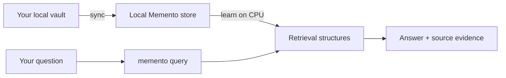

# Quick Start

> Install Memento, index a local vault, and retrieve traceable evidence in about
> five minutes.

[← Documentation](README.md) · [Installation](INSTALLATION.md) ·
[CLI reference](CLI.md) · [Troubleshooting](TROUBLESHOOTING.md)

## What you will build

By the end, a local daemon will manage a private memory store derived from your
vault. You will be able to ask a question and see both an answer and its source.



## Prerequisites

- macOS, Linux, or Windows on arm64 or x86_64
- an existing directory of Markdown notes, ideally an Obsidian vault
- Homebrew on macOS, or PowerShell 5.1+ on Windows

No GPU, embedding key, hosted database, or LLM API key is required.

## 1. Install Memento

From Codex, Claude Code, OpenClaw, or another coding agent, use the
[one-prompt installer](../AGENT_INSTALL.md). It installs the program and the
portable runtime skill, then configures MCP or CLI access for that host.

For a manual installation:

```bash
brew install ArvorCo/tap/memento
```

Windows PowerShell:

```powershell
git clone --depth 1 https://github.com/ArvorCo/memento.git
Set-Location memento
powershell.exe -NoProfile -ExecutionPolicy Bypass -File .\scripts\install.ps1
```

Linux users without Homebrew can use the verified release installer described
in the [installation guide](INSTALLATION.md).

Confirm all packaged interfaces are present:

```bash
memento --version
mementod --version
memento-mcp --version
memento-vault-sync --help
memento-agent-install --help
```

If you are building from source, follow [Installation → Build from
source](INSTALLATION.md#build-from-source), then return here.

## 2. Initialize a local brain

Use an existing vault:

```bash
memento init --vault-root "$HOME/Documents/MyVault"
```

Or let Memento create `~/MementoVault`:

```bash
memento init
```

Initialization creates the following default layout (`%USERPROFILE%\.memento`
on Windows):

```text
~/.memento/
├── config/
│   ├── daemon.toml       daemon, vault, and scheduler settings
│   └── vault_sync.toml   feeder sources and vault maintenance
├── sync/                 feeder manifests and incremental state
├── mementod.pid          daemon process identity while running
└── memento.sock          Unix only; Windows uses a local named pipe
```

It also detects common local session stores and attempts to start `mementod`.
Generated configuration is editable and contains no dependency on the source
repository when Memento was installed from a package.

## 3. Verify the setup

```bash
memento doctor
memento status
```

A healthy fresh store may contain zero chunks. What matters at this stage is
that configuration parses, enabled source paths exist, and the daemon responds.

`memento doctor` is the diagnostic command. `memento status` describes runtime
state: chunks, sources, vocabulary, document links, published segments,
coherence, and scheduled jobs.

## 4. Sync your vault

```bash
memento sync obsidian "$HOME/Documents/MyVault"
```

Use `obsidian` when wikilinks and vault structure matter. For a generic
directory, use:

```bash
memento sync folder "$HOME/Documents/ProjectNotes"
```

The first sync imports supported files. Later syncs compare the source against
its manifest, add changed files, preserve unchanged files, and remove stale
chunks for source files that were deleted.

> [!TIP]
> Add a `.mementoignore` file at the synced root before importing a large vault.
> Excluding build outputs, exports, and private subtrees improves both privacy
> and retrieval quality.

## 5. Learn the corpus

```bash
memento learn
```

Learning recomputes derived spectral signals and publishes updated runtime
state. Direct lexical and metadata retrieval remains available; learning adds a
corpus-specific signal rather than replacing exact search.

Run `memento status` again. Runtime segments and the document graph should now
report readiness when the corpus supports them.

## 6. Ask a question

```bash
memento query "What did we decide about authentication?"
```

Human output includes:

- a grounded extractive answer
- an estimated retrieval confidence
- ranked source paths and scores
- evidence excerpts

Try an exact identifier, a date, and a relationship expressed through
wikilinks:

```bash
memento query "ADR-0042"
memento query "What changed on 2026-08-10?"
memento query "Which projects link to the launch plan?" --limit 8
```

For scripts and agents, compact the evidence budget:

```bash
memento query "Summarize the release decision" \
  --output compact \
  --limit 5 \
  --max-content-chars 400
```

Use complete JSON when you need unabridged result content:

```bash
memento query "Summarize the release decision" --output json
```

## 7. Keep memory fresh

An installed feeder lets the daemon maintain a normalized vault containing
documents, sessions, and connectors. Review the generated feeder config, then
run one pass manually:

```bash
memento-vault-sync --config ~/.memento/config/vault_sync.toml capabilities
memento-vault-sync --config ~/.memento/config/vault_sync.toml --json run-all
memento sync obsidian "$HOME/Documents/MyVault"
memento learn
```

The default scheduler is configured during initialization when a feeder runner
is available. Its first automatic pass waits for the configured interval, so
onboarding cannot unexpectedly import every detected connector during daemon
startup. Run `memento-vault-sync ... run-all` when you want an immediate first
pass. If you use Homebrew services, restart the service after changing daemon
configuration:

```bash
brew services restart memento
memento status
```

## Success checklist

- [ ] `memento doctor` has no failing checks.
- [ ] `memento status` reports at least one source and one chunk after sync.
- [ ] A query returns the expected source path.
- [ ] Repeating the same sync reports unchanged files instead of duplicate data.
- [ ] No secret or unwanted directory is included in the source root.

## Where to go next

| Goal | Guide |
| --- | --- |
| Import PDFs, Office files, chats, or databases | [Ingestion](INGESTION.md) |
| Tune schedules, paths, and connectors | [Configuration](CONFIGURATION.md) |
| Connect an AI agent | [MCP integration](MCP.md) |
| Automate or isolate workflows | [Examples](EXAMPLES.md) |
| Understand ranking and confidence | [Retrieval design](RETRIEVAL.md) |
| Fix an unhealthy setup | [Troubleshooting](TROUBLESHOOTING.md) |
