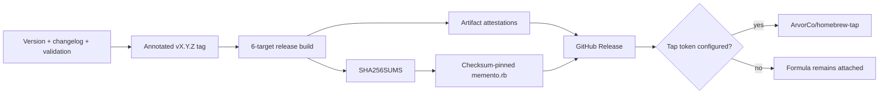

# Release Guide

> Produce a versioned, tested, checksum-pinned, provenance-attested Memento
> release and optionally publish it to the Homebrew tap.

[← Documentation](README.md) · [Installation](INSTALLATION.md) ·
[Benchmarks](BENCHMARKS.md) · [Changelog](../CHANGELOG.md)

## Release model

Memento releases are driven by an annotated Git tag matching the shared Cargo
workspace version.



Current artifacts are macOS/Linux `.tar.gz` archives, Windows `.zip` archives,
and a Homebrew formula. The workflow does not publish crates or Python packages
to public registries.

## Version policy

Every workspace package inherits the version in root `Cargo.toml`:

```toml
[workspace.package]
version = "0.1.0"
```

Use semantic versions:

- patch: compatible fixes and retrieval improvements without contract breakage
- minor before 1.0: feature or contract evolution, called out explicitly
- major: stable incompatible contract change after 1.0

Tags have the form `vX.Y.Z`. The release workflow rejects a tag whose stripped
version does not equal `memento-cli`'s Cargo version.

## Maintainer preflight

### 1. Define the release

- [ ] Update the workspace version.
- [ ] Update `CHANGELOG.md` with user-visible changes, upgrade notes, and known limitations.
- [ ] Update benchmark baseline if retrieval behavior changed.
- [ ] Update commands, config, architecture, and installation docs where applicable.
- [ ] Confirm the supported-version table in `SECURITY.md` remains correct.
- [ ] Decide whether a format/config migration is required and document it.

Check version propagation:

```bash
cargo metadata --no-deps --format-version 1 \
  | jq -r '.packages[] | [.name, .version] | @tsv'
```

### 2. Validate the tree

```bash
make release-check
make docs-check
cd memento-web && npm ci && npm run lint && npm run build
```

`make release-check` runs Rust format, Clippy, workspace tests, Python lint/tests,
shell syntax checks, documentation checks, and a locked optimized build of the
three shipped Rust binaries.

### 3. Run release smoke tests

Use an isolated store with the optimized binaries:

```bash
runtime_dir="$(mktemp -d /tmp/memento-release.XXXXXX)"
vault_dir="$(mktemp -d /tmp/memento-vault.XXXXXX)"
export MEMENTO_DATA_DIR="$runtime_dir"

printf '# Release fixture\n\nThe release phrase is silver orchard.\n' \
  > "$vault_dir/release.md"

target/release/memento init --vault-root "$vault_dir" --force
target/release/memento doctor
target/release/memento sync obsidian "$vault_dir" --json
target/release/memento learn --json
target/release/memento query "silver orchard" --output compact
target/release/memento-mcp --version
```

Also run the packaged feeder against fixture documents and run it twice to prove
incremental behavior.

### 4. Measure retrieval

For any ranking, chunking, learning, graph, or answer-composition change:

```bash
cargo run --release -p memento-research -- benchmark run \
  --dataset /absolute/path/to/benchmark.jsonl \
  --top-k 10 \
  --report /tmp/memento-release-benchmark.json
```

Compare quality and p50/p95 with the previous release under the same protocol.
Investigate every regression before tagging.

### 5. Audit release content

```bash
git status --short
git diff --check
rg -n '/Users/|/home/[^/ ]+|BEGIN (RSA|OPENSSH|EC) PRIVATE KEY|api[_-]?key|secret' \
  --glob '!target/**' \
  --glob '!node_modules/**' \
  .
```

Review matches manually. Confirm the tree contains no:

- personal vault paths or content
- credentials, DSNs, bearer tokens, or private keys
- private benchmark datasets/reports
- `.memento` stores or recovery snapshots
- generated build output

## Publish

Create and push an annotated tag from the intended release commit:

```bash
git tag -a v0.1.0 -m "Memento 0.1.0"
git show --show-signature v0.1.0
git push origin v0.1.0
```

Use a signed tag when maintainer signing infrastructure is configured. Do not
move a published release tag; issue a new version for corrections.

## CI pipeline

`.github/workflows/release.yml` performs:

### Validate

1. strip `v` from the tag
2. read `memento-cli` version through `cargo metadata`
3. fail if they differ

### Build matrix

| Runner | Target |
| --- | --- |
| `macos-15` | `aarch64-apple-darwin` |
| `macos-15-intel` | `x86_64-apple-darwin` |
| `ubuntu-22.04-arm` | `aarch64-unknown-linux-gnu` |
| `ubuntu-24.04` | `x86_64-unknown-linux-gnu` |

Each job runs a locked optimized build of:

- `memento`
- `mementod`
- `memento-mcp`

The archive also includes `tools/vault_sync`, README, and both licenses. Each
archive receives a GitHub artifact attestation before upload.

### Publish

The publish job:

1. downloads all four archives
2. creates `SHA256SUMS`
3. renders `memento.rb` with four immutable SHA-256 values
4. creates a GitHub release from the verified tag
5. attaches archives, checksums, and formula
6. updates `ArvorCo/homebrew-tap/Formula/memento.rb` when authorized

## Homebrew tap credentials

Set repository secret `HOMEBREW_TAP_TOKEN` only when automatic tap publication
is desired. The token needs the minimum permission required to update contents
in `ArvorCo/homebrew-tap`.

Without the secret, release publication still succeeds and `memento.rb` remains
attached for manual tap update or direct installation.

Review the generated formula:

```bash
ruby -c dist/memento.rb
brew style ./dist/memento.rb
```

The regular CI workflow already exercises formula rendering and Homebrew style
with synthetic checksums.

## Verify the published release

### Checksums

Linux:

```bash
sha256sum --check SHA256SUMS --ignore-missing
```

macOS:

```bash
shasum -a 256 memento-v0.1.0-aarch64-apple-darwin.tar.gz
grep 'memento-v0.1.0-aarch64-apple-darwin.tar.gz' SHA256SUMS
```

### Provenance

```bash
gh attestation verify memento-v0.1.0-x86_64-unknown-linux-gnu.tar.gz \
  --repo ArvorCo/memento
```

### Archive contents

```bash
tar -tzf memento-v0.1.0-x86_64-unknown-linux-gnu.tar.gz | sort
```

Windows:

```powershell
Expand-Archive .\memento-v0.1.0-x86_64-pc-windows-msvc.zip .\memento-release
Get-ChildItem .\memento-release -Recurse
```

Ensure expected binaries, feeder source, README, and licenses are present and no
unintended file appears.

### Installation smoke test

Test at least:

- current and previous macOS architecture when runners/hardware are available
- Linux x86_64
- Windows x64 and ARM64 release builds; run the native runtime smoke test on x64
- PowerShell installer, checksum verification, user PATH, and `.cmd` wrappers
- `memento init`, `doctor`, sync, learn, query
- feeder `--help`, `capabilities`, and one fixture conversion
- `memento-mcp --version` and MCP tool listing through a host
- Homebrew service start/restart/status

## Announce

A useful release note includes:

- outcome-oriented highlights
- installation and upgrade commands
- format/config compatibility notes
- measured retrieval deltas and benchmark limitations
- security-relevant changes
- known limitations
- links to changelog and documentation

Avoid claiming universal retrieval quality from a private ten-query suite.

## Failed or bad release

### Workflow fails before publication

Fix the cause on a new commit, delete the unpublished local/remote tag only when
no release or consumer can have observed it, then retag deliberately. Prefer a
new patch version if the tag was public.

### Release is published with a defect

1. mark the GitHub release clearly with the defect
2. stop or revert tap distribution if installation is unsafe
3. publish a fixed patch version
4. add upgrade/recovery instructions
5. never replace existing archives under the same tag
6. document the incident in the changelog when users could be affected

For a security defect, follow coordinated disclosure in
[SECURITY.md](../SECURITY.md).

## Post-release checklist

- [ ] GitHub release contains all six archives, `SHA256SUMS`, and `memento.rb`.
- [ ] Attestation verification succeeds for each target.
- [ ] Tap formula matches the attached formula and checksums.
- [ ] Homebrew install and service smoke tests pass.
- [ ] Documentation default version/examples are still correct.
- [ ] Milestone/issues are updated with real release status.
- [ ] Next development section exists in `CHANGELOG.md`.
