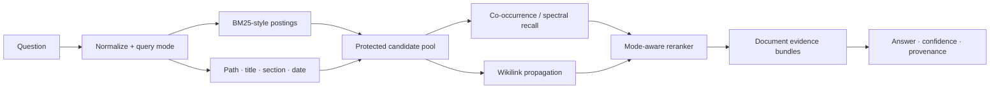

# Retrieval Design

> Memento retrieves language with exact, structured, graph, and corpus-derived
> signals. Learned similarity expands recall; it never owns the whole search.

[← Documentation](README.md) · [Architecture](ARCHITECTURE.md) ·
[Benchmarks](BENCHMARKS.md) · [CLI reference](CLI.md#memento-query)

## Design thesis

Personal memory has properties generic embedding search routinely underuses:

- exact identifiers, names, and quoted phrases matter
- dates and paths can be stronger than semantic resemblance
- note titles and headings carry disproportionate meaning
- wikilinks represent intentional human structure
- “what did we decide?” and “where is the policy?” are different query modes
- the best passage may need neighboring sections to answer a list or plan question

Memento therefore uses a staged ranker. Cheap, inspectable signals generate a
bounded pool. More contextual signals rerank only that pool.



## 1. Parsing and chunking

Documents are normalized into canonical text and split with structure-aware
rules:

- document sections prefer Markdown headings and paragraphs
- long blocks fall back to overlapping character windows approximating tokens
- sessions prefer conversation turns before sliding windows
- every chunk retains `doc_id`, source path, source-relative chunk index,
  section title, token IDs, and a reference into canonical document text

The default smart chunker used for raw ingest targets 512 tokens with 64-token
overlap. Source parsers can supply stronger structure.

Chunking is not merely a storage concern: candidate generation happens at chunk
granularity, while final ranking and evidence assembly happen at document
granularity.

## 2. Query normalization

The query pipeline:

1. tokenizes Unicode alphanumeric sequences
2. lowercases both original and diacritic-folded forms
3. drops a small list of low-signal English and Portuguese question words from
   ranking terms
4. deduplicates terms and maps known tokens to stable vocabulary IDs
5. groups selected inflections and high-value English/Portuguese translations
   as disjunctions
6. detects complete ISO-like dates and classifies query intent

Disjunction groups are important. If `decisão`, `decisions`, and `decision` are
alternatives for one concept, a document does not get triple credit for matching
multiple spellings. This is a deterministic bridge, not a claim of general
machine translation or full morphological analysis.

## 3. Query modes

Memento selects one of three modes from explicit query language:

| Mode | Example | Ranking emphasis |
| --- | --- | --- |
| Document lookup | “Which file contains the launch catalog?” | title/path exactness, entity identity, canonical document |
| Episodic recall | “What did we decide in the sprint?” | dated/session material, temporal match, direct evidence |
| Concept search | “How does local memory persistence work?” | lexical coverage, learned similarity, metadata, graph context |

Mode classification changes weights; it does not switch to a separate index.
When no explicit marker is present, concept search is the default.

## 4. Inverted index and BM25

The rebuildable lexical index stores:

- token → chunk postings with term frequency
- metadata term → chunk postings
- document → token IDs
- document → metadata terms
- document → chunk positions
- source chunk counts and latest date ordinal

For query group \(t\) and chunk \(d\), the lexical core uses standard BM25-like
term saturation:

\[
\operatorname{BM25}(t,d) = \operatorname{IDF}(t)
\frac{tf(t,d)(k_1 + 1)}
{tf(t,d) + k_1(1-b+b\frac{|d|}{\operatorname{avgdl}})}
\]

with \(k_1 = 1.2\), \(b = 0.75\), and:

\[
\operatorname{IDF}(t) = \ln\left(1 +
\frac{N-df(t)+0.5}{df(t)+0.5}\right)
\]

Within a disjunction group, only the strongest alternative contributes. Across
groups, scores accumulate. Candidate lexical score is:

\[
L = 0.72\,\widehat{BM25} + 0.28\,C_{idf}
\]

where \(C_{idf}\) is matched query IDF divided by total query IDF. This gives
rare query coverage an explicit role instead of allowing repeated common words
to dominate.

The expensive rerank pool is bounded to `max(top_k, 10) × 32` chunks. Query
cost therefore follows postings and the candidate budget rather than scanning
every vault document.

## 5. Metadata and exactness

Metadata postings include source path, section title, and document title.
Matches are weighted by document-level rarity:

\[
w(t) = \ln\left(\frac{D+1}{df_{meta}(t)+1}\right)+1
\]

Numeric metadata terms receive a `2.5×` base weight. When the query contains a
complete three-part date and a candidate satisfies every numeric part, that
candidate is protected at the front of the candidate pool.

Additional rerank signals include:

- all-term metadata match bonus
- exact folded query substring in metadata
- filename/stem agreement
- entity/profile match
- explicit complete-date equality
- source compactness, which mildly favors a sharp small source over a huge dump

This is why Memento can retrieve `ADR-0042` or `2026-08-10` without hoping a
neural representation preserved the exact symbol.

## 6. Learned co-occurrence and spectral projections

During ingest, Memento builds a symmetric sparse token co-occurrence matrix
using a five-token sliding window. The center token is paired with each distinct
context token at weight `1/5`; short sequences connect all distinct pairs with
weight `1/length`.

`memento learn` computes a bounded eigendecomposition of that sparse matrix.
The number of requested components adapts to non-zero count:

| Matrix non-zeros | Target components |
| ---: | ---: |
| `≤ 50,000` | 32 |
| `50,001–250,000` | 24 |
| `250,001–1,000,000` | 16 |
| `> 1,000,000` | 12 |

The target is capped below vocabulary size; corpora too small for two components
skip learning.

A token set \(T\) is projected into the learned basis \(V\) by summing its rows
and L2-normalizing:

\[
p(T) = \frac{\sum_{t \in T} V_{t,:}}
{\left\|\sum_{t \in T} V_{t,:}\right\|_2}
\]

Chunks use the same projection, quantized to signed 16-bit values for the
runtime segment. Document projections are means of their chunk projections.
Cosine similarity between query and chunk/document projections becomes one
bounded rerank signal.

The code calls these stored projections “embeddings,” but they are **not**
neural embeddings from an external model. They are corpus-local spectral
coordinates derived from Memento's own sparse co-occurrence matrix.

Learned token relationships also produce at most 32 semantic expansion terms.
These expansion-only candidates are appended after exact textual and metadata
candidates. A change in eigen dimensionality therefore cannot evict direct
lexical recall.

> [!NOTE]
> Spectral similarity is useful but not sacred. It is deliberately subordinate
> to exact evidence and must earn its value in benchmarks.

## 7. Document graph

Obsidian wikilinks create a directed graph. A written link has weight `1.0`; its
reverse backlink has weight `0.35`. Ambiguous filename stems do not create an
edge.

The graph is queried locally rather than ranked globally:

1. take up to 64 strong lexical candidates
2. convert their document scores into restart seeds
3. normalize seed mass
4. run three weighted walk steps
5. restart from lexical seeds with probability `0.25` per step
6. normalize and retain a bounded number of graph documents

For transition matrix \(P\), restart distribution \(r\), and
\(\alpha = 0.25\):

\[
x_{i+1} = \alpha r + (1-\alpha)P^T x_i
\]

This is personalized PageRank over a tiny query-relevant neighborhood. It can
surface a linked decision or evidence note with no word overlap while keeping
work bounded.

## 8. Mode-aware reranking

Chunk scoring blends normalized signals with weights chosen for the query mode.
The table summarizes the current 0.1.x emphasis; exact formulas live in
`mementod/src/manager/query_pipeline.rs` and are benchmark-sensitive.

| Signal | Lookup | Recall | Concept |
| --- | ---: | ---: | ---: |
| Lexical chunk score | 0.22 | 0.40 | 0.34 |
| Metadata overlap | 0.16 | 0.15 | 0.15 |
| Metadata exactness | 0.18 | 0.10 | 0.08 |
| Entity score | 0.24 | — | — |
| Learned token expansion | 0.05 | 0.15 | 0.18 |
| Spectral chunk projection | 0.05 | 0.10 | 0.14 |
| Graph score | 0.06 | 0.06 | 0.06 |

Smaller query-coverage and source-compactness terms complete each mixture;
metadata exact-match bonuses are additive. Scores are then aggregated per
document using the best and second-best passages, document-wide lexical
coverage, graph score, specificity, and mode-specific temporal/classification
biases.

Explicit dates receive a strong temporal term only when the complete date
matches. Freshness is contextual: it activates only after adequate lexical
agreement, so a newer irrelevant note does not automatically outrank an older
exact one.

## 9. Document-aware evidence bundles

Returning only the sharpest chunk breaks questions about plans, catalogs, and
multi-section decisions. Memento ranks documents, then builds bounded bundles:

- top document: up to 6 chunks
- second and third documents: up to 4 chunks each
- later documents: up to 2 chunks each
- adjacent or strongly supporting chunks are preferred
- remaining capacity samples across the canonical document

Frontmatter and Memento-generated navigation blocks are stripped from evidence
text. The source path and first included chunk index remain attached.

This design improves coverage without reopening the entire document or scanning
the vault at answer time.

## 10. Answer generation

The result set becomes at most five evidence objects. Memento's local generator
selects and composes evidence-bound text using query semantics and the learned
matrix. If semantic generation fails, it falls back to extractive evidence
composition.

There is no hosted LLM requirement. The answer is a convenience layer over
ranked evidence, not a replacement for it. Applications that need strict
evidence can use:

```bash
memento query "your question" --output compact
```

or MCP search with `include_answer = false`.

## 11. Confidence

Reported confidence is:

\[
C = 0.45S_1 + 0.35Q + 0.15M + 0.05C_{matrix}
\]

where:

- \(S_1\): top document score, clamped to `[0, 1]`
- \(Q\): top document query coverage
- \(M\): normalized margin over the second result
- \(C_{matrix}\): query confidence from the co-occurrence matrix

If there is no top result, confidence is zero.

Confidence estimates **retrieval separation and coverage**. It is not a
probability that every answer sentence is true, nor is it calibrated across all
possible corpora. Consumers should inspect evidence and apply their own
thresholds based on a representative evaluation set.

## Complexity model

Let `P(q)` be the postings touched by query groups, `C` the bounded candidate
pool, `k` spectral dimensions, and `E_local` the small graph neighborhood.

| Stage | Approximate query cost |
| --- | --- |
| Lexical candidates | `O(P(q))` |
| Metadata candidates | `O(metadata postings)` |
| Spectral candidate scoring | `O(C × k)` after cached projections |
| Graph propagation | `O(3 × E_local)` |
| Rerank and bundle | `O(C log C)` plus bounded document chunks |

The learn step is intentionally off the hot query path. Its eigensolver and
runtime segment publication are CPU work performed after ingest or on demand.

## What Memento does not claim

- The curated bilingual bridges are not universal multilingual NLP.
- Spectral projections are not guaranteed to beat modern neural embeddings on
  every semantic benchmark.
- Confidence is not factual entailment.
- A ten-query private corpus regression suite is not general proof.
- Current weight mixtures are engineering parameters, not timeless constants.

The standard is measured improvement. Retrieval changes should report hit rate,
MRR, term recall, and p50/p95 latency against the same corpus, then add
adversarial cases for the failure they intend to fix.
