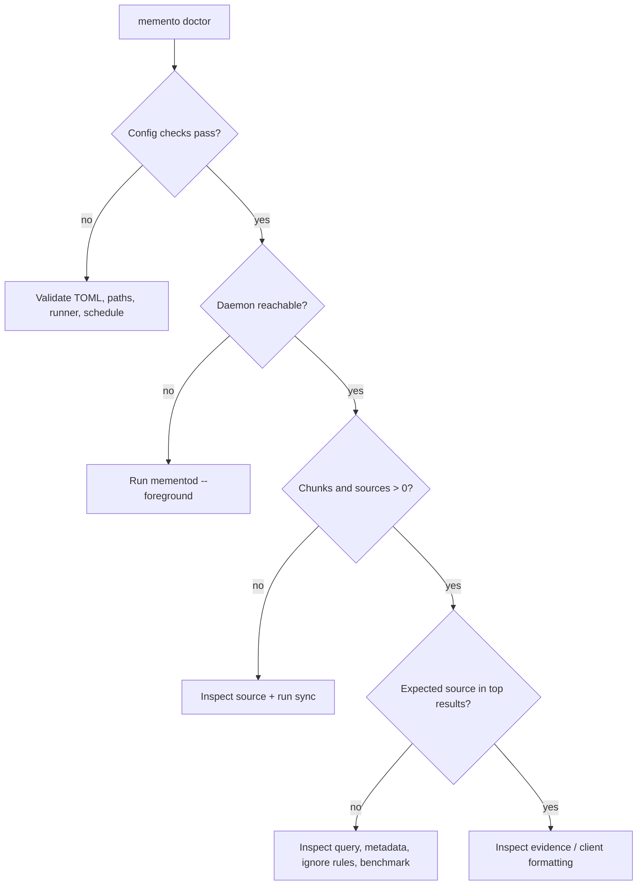

# Troubleshooting

> Diagnose Memento from the outside in: installation → configuration → daemon →
> source pipeline → retrieval.

[← Documentation](README.md) · [Configuration](CONFIGURATION.md) ·
[CLI reference](CLI.md) · [Support](../SUPPORT.md)

## First response

Run these before changing or deleting anything:

```bash
memento --version
memento doctor
memento status --json
```

Then inspect the daemon log:

```bash
tail -n 100 ~/.memento/mementod.log
```

For a non-default store, apply the same environment to every command:

```bash
export MEMENTO_DATA_DIR=/absolute/path/to/store
memento doctor
memento status --json
```



## Installation

### `command not found`

Check what is installed:

```bash
command -v memento
command -v mementod
command -v memento-mcp
command -v memento-vault-sync
brew list memento
```

Homebrew installs four commands. If the formula is installed but the shell
cannot find it, repair the Homebrew shell environment rather than copying
binaries into random directories.

For a source checkout, use the explicit package commands:

```bash
cargo run -p memento-cli -- --version
cargo run -p mementod -- --version
uv run python -m tools.vault_sync.cli --help
```

### Windows

If PowerShell blocks the reviewed installer, do not weaken the machine-wide
policy. Run only that process with an explicit override:

```powershell
powershell.exe -NoProfile -ExecutionPolicy Bypass -File .\scripts\install.ps1
```

If a new terminal cannot find Memento, inspect and repair the current-user
`PATH`, then reopen the terminal:

```powershell
$bin = Join-Path $env:LOCALAPPDATA "Programs\Memento\bin"
$env:Path -split ';'
Get-Command "$bin\memento.exe"
```

For an unreachable daemon, confirm every process uses the same store and read
the startup log:

```powershell
Get-ChildItem Env:MEMENTO_*
memento doctor
Get-Content "$HOME\.memento\mementod.log" -Tail 100
mementod --foreground
```

Windows has no `memento.sock` file. The endpoint is a named pipe derived from
the absolute `MEMENTO_DATA_DIR`; an intentional `MEMENTO_PIPE` override must be
identical in daemon, CLI, and MCP environments. Do not delete the data directory
to troubleshoot a pipe.

If `memento-vault-sync.bat` is missing, rerun the installer with
`-Program skip -Feeder always`. This installs an isolated Python 3.12
environment, using WinGet only when Python is absent. Core Obsidian and folder
sync remain available without the Python feeder.

### Version mismatch

```bash
memento --version
mementod --version
memento-mcp --version
```

All packaged Rust binaries should report the same release. Restart the service
after upgrade so an old daemon process is not serving a new CLI.

```bash
brew upgrade ArvorCo/tap/memento
brew services restart memento
```

## Initialization and configuration

### `memento init` preserves an old config

This is intentional when the existing file differs from generated defaults.
Review the diff, back up deliberate changes, then opt into replacement:

```bash
cp ~/.memento/config/daemon.toml /tmp/daemon.toml.backup
cp ~/.memento/config/vault_sync.toml /tmp/vault_sync.toml.backup
memento init --vault-root "$HOME/Documents/MyVault" --force
memento doctor
```

Do not use `--force` reflexively on a production brain; it can replace custom
source and scheduler definitions.

### TOML parse failure

Common causes:

- missing closing quote or bracket
- duplicate table header
- `[[array.of.tables]]` written as `[array.of.tables]`
- a Windows path with unescaped backslashes
- a database query containing an unescaped TOML quote

Compare against
[`tools/vault_sync/config.example.toml`](../tools/vault_sync/config.example.toml)
and run `memento doctor` after each correction.

### Wrong store or socket

Symptom: the daemon is running, but CLI/MCP sees zero chunks or cannot connect.

```bash
env | grep '^MEMENTO_' || true
ls -la "${MEMENTO_DATA_DIR:-$HOME/.memento}"
```

`mementod --data-dir /other/store` alone does not redirect the CLI. Export the
same `MEMENTO_DATA_DIR` for daemon, CLI, and MCP host.

## Daemon

### Daemon is unreachable

Run it attached and read the actual failure:

```bash
RUST_LOG=mementod=debug mementod --foreground
```

In another terminal, with the same environment:

```bash
memento status
```

Likely causes:

- another process owns the configured socket/store
- the data directory is not writable
- scheduler TOML is invalid
- a current runtime segment is unreadable
- the daemon process and CLI use different data directories

The daemon removes a stale socket on startup. Do not delete the entire store to
clear a socket problem.

### PID exists but daemon never becomes ready

The CLI waits when the recorded PID is alive. Inspect it and the log:

```bash
cat ~/.memento/mementod.pid
ps -p "$(cat ~/.memento/mementod.pid)" -o pid,etime,command
tail -n 200 ~/.memento/mementod.log
```

A large store can take time to load. If the process is alive and making progress,
do not launch a second writer. If it exited, foreground startup gives the safest
diagnostic.

### Homebrew service loops or exits

```bash
brew services info memento
tail -n 200 "$(brew --prefix)/var/log/mementod.log"
mementod --foreground
```

If foreground succeeds, inspect service environment differences—especially
`MEMENTO_DATA_DIR`, database DSNs, feeder paths, and macOS Automation access.

## Scheduler

### Scheduler is disabled

`memento status` may report disabled when the feeder runner was not available at
initialization. Direct imports still work.

Install or configure the runner, then update `daemon.toml`:

```toml
[vault_sync_runner]
command = ["memento-vault-sync"]

[scheduler]
enabled = true
```

Restart the daemon and run `memento doctor`.

### Invalid interval

Valid examples: `15m`, `4h`, `1d`. Invalid examples: `30s`, `1.5h`, `1h30m`.

### Job runs but reports feeder failure

Run the exact feeder step manually as the same user:

```bash
memento-vault-sync --config ~/.memento/config/vault_sync.toml --json run-all
```

Check source permissions, converter availability, database DSN environment, and
platform automation permissions. The scheduler intentionally stops before
daemon sync if the feeder fails.

## Feeder and source conversion

### `unrecognized arguments: --json` or `--config`

Global feeder options must precede the subcommand.

Correct:

```bash
memento-vault-sync --config ~/.memento/config/vault_sync.toml --json run-all
```

Incorrect:

```bash
memento-vault-sync run-all --json
```

### Source is skipped

Inspect capabilities and enabled source names:

```bash
memento-vault-sync --config ~/.memento/config/vault_sync.toml capabilities
```

Confirm:

- `enabled = true`
- source path exists for the service account
- extension appears in `include_extensions`
- file is below `max_file_bytes`
- parent directory is not in `exclude_dirs`
- source name passed to the command matches exactly

### PDF has no useful text

Direct PDF extraction requires a text layer. Use the feeder:

```bash
memento-vault-sync --config ~/.memento/config/vault_sync.toml capabilities
memento-vault-sync --config ~/.memento/config/vault_sync.toml \
  import-documents research
```

Install Poppler for layout extraction and Tesseract for image-only OCR. Confirm
the required OCR language data is installed. Inspect the generated Markdown;
OCR success does not guarantee table, equation, or handwriting accuracy.

### Office conversion fails

`docx`, `pptx`, `xlsx`, and related binary formats belong in the document
feeder, not direct import. Current Office XML formats have native Python
converters; inspect `memento-vault-sync ... capabilities` and confirm the feeder
environment contains its packaged requirements. Pandoc is a fallback for
additional formats. Legacy `.doc` may also need LibreOffice or macOS `textutil`.

### Database import fails

Check in order:

1. query begins with `SELECT` or `WITH`
2. `id_column` exists, is non-empty, and unique
3. configured column aliases match returned names
4. SQLite file exists and is readable
5. remote `dsn_env` is set in the invoking process
6. `psycopg` or `pymysql` is installed in the feeder environment
7. the database account has read-only grants

Run only the failing source:

```bash
memento-vault-sync --config ~/.memento/config/vault_sync.toml \
  --json import-databases decisions
```

### Apple Notes export fails

Run the command interactively once. macOS may prompt for Automation permission.
Services do not necessarily inherit a terminal's permission or environment.
Check System Settings → Privacy & Security → Automation for the process that
invokes the feeder.

## Synchronization

### Sync reports zero files on first run

```bash
find "$HOME/Documents/MyVault" -type f | head
sed -n '1,200p' "$HOME/Documents/MyVault/.mementoignore" 2>/dev/null || true
```

Check supported extensions, built-in skipped directories, ignore rules, file
permissions, empty files, and whether the path points to the expected root.

### Repeated sync reimports everything

For direct sync, ensure source modification times are stable. Tools that rewrite
files without content changes still change the direct fingerprint.

For the feeder, verify the state directory persists and is writable. Its
content-hash manifests live under `[vault].state_dir`; placing that directory in
ephemeral storage removes incremental history.

### A deletion removed unexpected memory

Stop automated runs and identify ownership:

- direct source manifests: `~/.memento/manifests/`
- feeder manifests: configured `state_dir`
- generated frontmatter and `memento_generated: true`

Do not mutate manifest JSON by hand. Reproduce the same source layout in an
isolated store, confirm the ownership bug, and open a sanitized report.

## Retrieval quality

### Expected source is missing

Use this order:

1. confirm the source exists in the maintained vault
2. confirm sync reported it as added/updated
3. check `memento status` corpus counts
4. query an exact unique phrase from the source
5. query the filename/title and a complete date separately
6. run `memento learn`
7. inspect full JSON to remove terminal formatting as a variable

```bash
memento query "unique fixture phrase" --output json --limit 10
```

If exact text fails, the problem is ingestion/indexing—not semantic ranking.

### Results are noisy

- tighten `.mementoignore`
- remove broad exports or generated build trees from the source root
- improve titles, headings, frontmatter dates, and deliberate wikilinks
- ask a query with distinguishing terms rather than generic question grammar
- split giant dump files into coherent documents
- use the benchmark runner before changing weights

### A newer summary beats the original decision

Try explicit source/identity language (“which file”, exact title) or a complete
date. Memento uses mode-specific freshness and memory classification; a
reproducible wrong ranking should become a benchmark case, not an ad hoc weight
change.

### Confidence looks high but answer is wrong

Confidence measures retrieval strength, coverage, and separation. It is not
factual entailment. Inspect the evidence paths and excerpts. If correct evidence
was retrieved but composed incorrectly, report an answer-generation case. If
the wrong source ranked first, report a retrieval case.

## MCP client cannot start or call tools

Check:

```bash
memento-mcp --version
memento status
codex mcp list
```

Common causes:

- command not on the MCP host's `PATH`
- host and daemon have different `MEMENTO_DATA_DIR`
- `mementod` is not running
- host startup timeout is too short for a large cold store
- a wrapper writes non-protocol text to stdout
- exact `source_path` was not copied from search before document read

Use an absolute command path if the GUI host has a restricted `PATH`. Keep logs
on stderr.

## HTTP returns `401 Unauthorized`

`/health` is public on the configured listener; other routes need a token:

```bash
token="$(< ~/.memento/config/http_auth_token)"
curl -H "Authorization: Bearer $token" \
  http://127.0.0.1:8765/status
```

If `MEMENTO_HTTP_TOKEN` was supplied to the daemon, the token file may not match
the active value.

## Isolate the problem safely

Create a disposable store and fixture:

```bash
runtime_dir="$(mktemp -d /tmp/memento-runtime.XXXXXX)"
vault_dir="$(mktemp -d /tmp/memento-vault.XXXXXX)"
printf '# Launch\n\nThe fixture decision is cobalt hummingbird.\n' > "$vault_dir/launch.md"

export MEMENTO_DATA_DIR="$runtime_dir"
memento init --vault-root "$vault_dir" --force
memento sync obsidian "$vault_dir" --json
memento query "cobalt hummingbird" --output compact
```

If the fixture works, the binary/runtime path is healthy and the failure is in
production source/config/data. If it fails, the reproduction is safe to share
after replacing temporary paths.

## Collect a privacy-safe report

Include:

```bash
memento --version
mementod --version
uname -a
memento doctor
memento status --json
```

Also include the smallest synthetic fixture and exact commands. Remove:

- personal paths and usernames
- vault content unrelated to the fixture
- database DSNs and HTTP tokens
- raw `.memento` files
- private benchmark reports

Use [SUPPORT.md](../SUPPORT.md) for the correct reporting channel. Security
issues follow [SECURITY.md](../SECURITY.md), never a public bug report.
